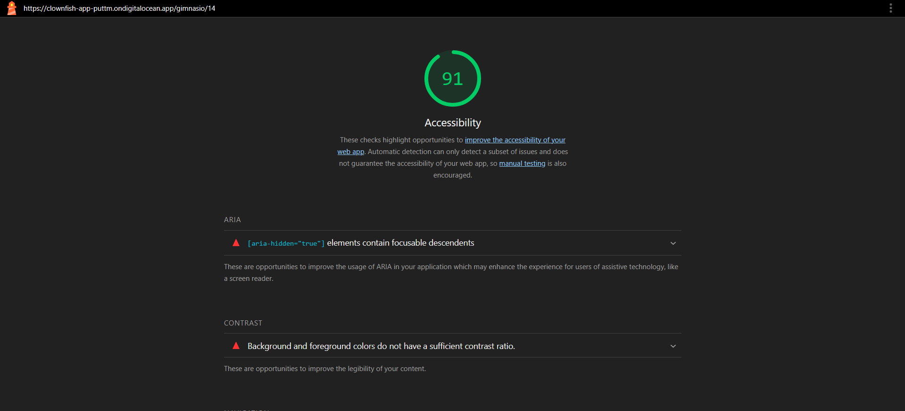
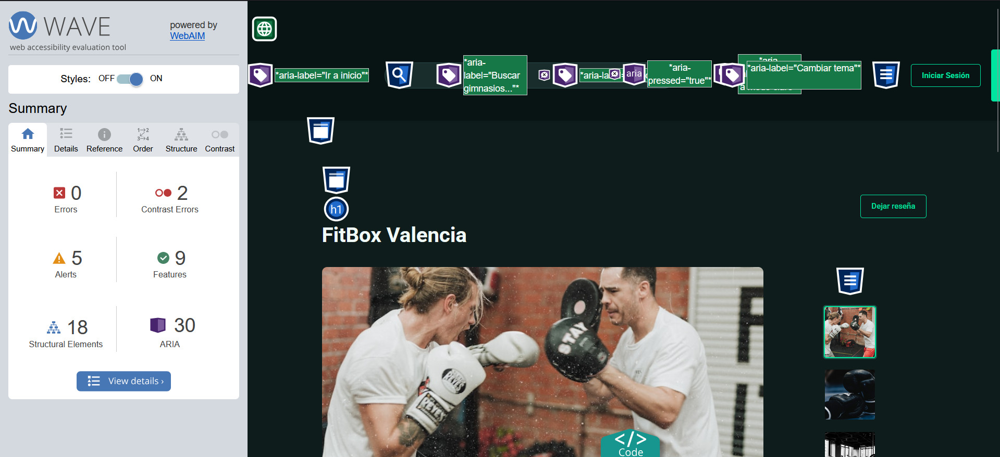
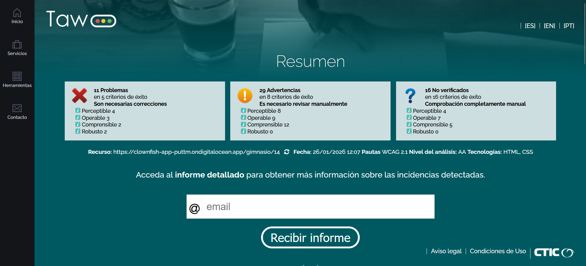

## 1. Fundamentos de accesibilidad

### ¿Por qué es necesaria la accesibilidad web?

La accesibilidad web es fundamental porque permite que cualquier persona, sin importar sus capacidades, pueda usar y disfrutar de una web. En mi proyecto Gymunity, he pensado en usuarios con discapacidad visual (por ejemplo, personas ciegas que usan lectores de pantalla), auditiva (quienes no pueden oír los vídeos o sonidos), motora (dificultad para usar el ratón o el teclado) y cognitiva (problemas de comprensión o concentración). Además, hacer la web accesible no solo ayuda a estas personas, sino que mejora la experiencia para todos: por ejemplo, alguien con mala conexión, o que navega desde el móvil, también se beneficia. En España y Europa, la accesibilidad es obligatoria por ley en webs públicas y muchas privadas, así que es algo que no se puede ignorar.

### Los 4 principios de WCAG 2.1

1. **Perceptible:** La información y los elementos de la web deben poder ser percibidos por todos.
	- Ejemplo: En la galería de gimnasios, cada imagen tiene texto alternativo (alt) que describe lo que aparece, así una persona ciega sabe si la foto es de "Entrenamiento con barra" o "Sesión de boxeo".

2. **Operable:** Todo debe poder usarse con diferentes métodos, no solo con el ratón.
	- Ejemplo: Los menús y botones de Gymunity se pueden navegar con el teclado, así una persona con movilidad reducida puede moverse por la web sin problemas.

3. **Comprensible:** El contenido y la navegación deben ser fáciles de entender.
	- Ejemplo: Los textos de los gimnasios y clases son claros, sin tecnicismos, y los formularios tienen instrucciones sencillas para que cualquier usuario sepa qué poner.

4. **Robusto:** La web debe funcionar bien en diferentes navegadores y tecnologías de asistencia.
	- Ejemplo: He probado Gymunity en Chrome, Firefox y con el lector NVDA, y todo se muestra correctamente, incluidos los toasts de notificación.

### Niveles de conformidad

Las WCAG tienen tres niveles: A (mínimo), AA (recomendado y exigido por ley en España), y AAA (máximo, muy difícil de lograr en todo). El objetivo de Gymunity es cumplir el nivel AA, para que la web sea realmente usable por la mayoría de personas y cumpla la normativa.

---

## 2. Componente multimedia implementado

### Tipo de componente: Galería de imágenes

He implementado una galería fotográfica que muestra las instalaciones de cada gimnasio. Cuando entras en la página de un gimnasio, ves su foto principal y un carrusel con más fotos de las zonas (sacos de boxeo, zona de cardio, ring, etc.). Al hacer clic en una imagen pequeña, se abre a tamaño grande con su descripción abajo.

### Características de accesibilidad implementadas

- **Texto alternativo descriptivo:** Cada imagen tiene un atributo alt que describe exactamente lo que se ve, no genéricos tipo "foto1" o "imagen", sino cosas reales como "Rack de pesas" o "Entrenamiento con barra", así los lectores de pantalla pueden decir qué hay en cada foto.

- **Navegación con teclado:** Puedes moverte por las imágenes de la galería usando la tecla Tab, sin necesidad de ratón, para que personas con problemas motores puedan ver todas las fotos.

- **Contraste suficiente:** Las descripciones (figcaption) tienen fondo oscuro y texto claro, con un contraste que cumple AA, para que sean legibles incluso con poca visión.

- **Estructura semántica:** He usado las etiquetas HTML correctas (figure, figcaption, img) en vez de solo div y span, así los lectores de pantalla entienden que es una galería y no un montón de elementos sueltos.

---

## 3. Análisis de accesibilidad inicial

### Resultados de las herramientas

| Herramienta | Puntuación/Errores | Captura |
|-------------|-------------------|---------|
| Lighthouse | 91/100 |  |
| WAVE | 2 errores, 5 alertas |  |
| TAW | 11 problemas, 29 advertencias |  |

### Problemas más graves detectados

1. **Controles de formulario sin etiquetar**
   - Las herramientas detectaron que algunos campos de formulario (como el buscador o los inputs de login) no tienen etiquetas `<label>` asociadas, lo que dificulta a los lectores de pantalla saber qué hay que escribir en cada campo. Esto afecta principalmente a usuarios ciegos.
   - Criterios WCAG afectados: H44, H65

2. **Enlaces sin contenido**
   - Hay enlaces que están vacíos o que no tienen texto visible, solo un icono. Esto hace que los lectores de pantalla digan "enlace" sin explicar a dónde lleva, dejando al usuario perdido sin saber qué hace ese botón.
   - Criterio WCAG afectado: F89

3. **Elementos sin rol ARIA o semántica incorrecta**
   - Algunos botones o elementos interactivos no están bien etiquetados, por lo que las tecnologías de asistencia no saben que son clicables o para qué sirven.

---

## 4. Análisis y corrección de errores

### Tabla resumen de errores

| # | Error | Criterio WCAG | Herramienta | Solución aplicada |
|---|-------|---------------|-------------|-------------------|
| 1 | Controles de formulario sin etiquetar | 1.3.1, 3.3.2 | TAW, WAVE | Añadido `<label>` y atributo `for` a inputs |
| 2 | Enlaces sin contenido | 2.4.4 | TAW | Añadido texto descriptivo o `aria-label` |
| 3 | Botones sin semántica correcta | 4.1.2 | TAW | Cambio de `<div>` a `<button>` con `type` |
| 4 | Sin sugerencias en errores de formulario | 3.3.3 | TAW | Añadido mensajes de ayuda con ejemplos |
| 5 | Falta prevención de errores en formularios | 3.3.4 | TAW | Añadido confirmación antes de borrar datos |

### Detalle de cada error

#### Error #1: Campos de formulario sin etiqueta

**Problema:** Los campos de búsqueda y algunos inputs del formulario de login no tenían etiquetas `<label>` asociadas, por lo que al enfocarse con un lector de pantalla, solo decía "campo de texto" sin explicar qué hay que escribir ahí.

**Impacto:** Afecta principalmente a usuarios ciegos que usan NVDA o JAWS, porque no saben si tienen que poner el email, la contraseña o qué están escribiendo.

**Criterio WCAG:** 1.3.1 (Información y relaciones), 3.3.2 (Etiquetas o instrucciones)

**Código ANTES:**
```html
<input type="text" placeholder="Buscar gimnasio..." />
```

**Código DESPUÉS:**
```html
<label for="buscador">Buscar gimnasio</label>
<input id="buscador" type="text" placeholder="Buscar gimnasio..." />
```

---

#### Error #2: Enlaces sin texto visible

**Problema:** Algunos enlaces de redes sociales o iconos de navegación no tenían texto dentro, solo el icono SVG, lo que hace que el lector de pantalla diga "enlace" sin más contexto sobre a dónde lleva.

**Impacto:** Usuarios ciegos no saben si el enlace va a Instagram, Facebook o cualquier otra parte de la web.

**Criterio WCAG:** 2.4.4 (Propósito de los enlaces en contexto)

**Código ANTES:**
```html
<a href="https://instagram.com/gymunity">
  <i class="fab fa-instagram"></i>
</a>
```

**Código DESPUÉS:**
```html
<a href="https://instagram.com/gymunity" aria-label="Síguenos en Instagram">
  <i class="fab fa-instagram"></i>
</a>
```

---

#### Error #3: Divs usados como botones

**Problema:** Algunos botones de la web estaban hechos con `<div>` y eventos onClick, en vez de usar la etiqueta `<button>` real. Esto confunde a los lectores de pantalla porque no saben que es un botón clicable.

**Impacto:** Usuarios con teclado o lectores de pantalla no pueden activar el botón fácilmente, y la navegación con Tab no funciona bien.

**Criterio WCAG:** 4.1.2 (Nombre, función, valor)

**Código ANTES:**
```html
<div class="boton-reservar" (click)="reservar()">
  Reservar clase
</div>
```

**Código DESPUÉS:**
```html
<button type="button" class="boton-reservar" (click)="reservar()">
  Reservar clase
</button>
```

---

#### Error #4: Formularios sin sugerencias de corrección

**Problema:** Cuando el usuario se equivoca al rellenar un formulario (por ejemplo, pone un email sin @), solo sale un mensaje genérico "Email inválido", sin explicar qué formato se espera ni dar ejemplos.

**Impacto:** Usuarios con dificultades cognitivas o poca experiencia no entienden qué tienen que corregir ni cómo hacerlo bien.

**Criterio WCAG:** 3.3.3 (Sugerencias ante errores)

**Código ANTES:**
```typescript
if (!email.includes('@')) {
  this.error = 'Email inválido';
}
```

**Código DESPUÉS:**
```typescript
if (!email.includes('@')) {
  this.error = 'Email inválido. Debe incluir @ y un dominio. Ejemplo: usuario@gmail.com';
}
```

---

#### Error #5: Sin confirmación antes de borrar datos

**Problema:** Al borrar una reserva o cancelar una clase, se borraba directamente sin pedir confirmación, lo que puede hacer que alguien pierda sus datos por error o por pulsar sin querer.

**Impacto:** Usuarios con problemas motores o que usan teclado pueden pulsar el botón de borrar por accidente y perder su reserva sin poder recuperarla.

**Criterio WCAG:** 3.3.4 (Prevención de errores)

**Código ANTES:**
```typescript
eliminarReserva(id: number) {
  this.reservaService.eliminar(id).subscribe();
}
```

**Código DESPUÉS:**
```typescript
eliminarReserva(id: number) {
  if (confirm('¿Seguro que quieres cancelar esta reserva? No se puede deshacer.')) {
    this.reservaService.eliminar(id).subscribe();
  }
}
```