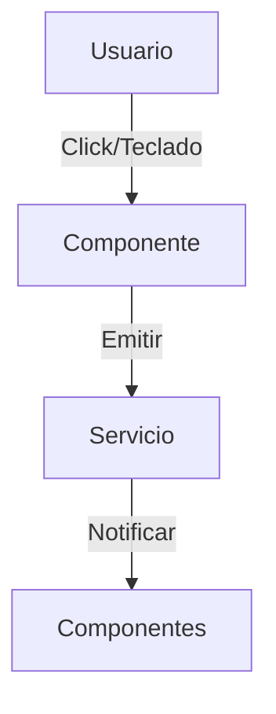
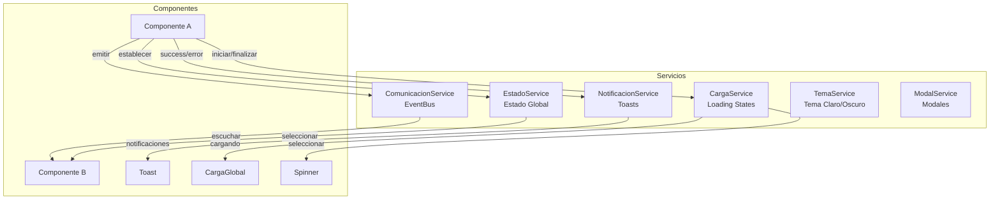

# Documentación Técnica del Cliente - Gymunity

---

## Fase 1: Arquitectura de Eventos

### 1.1 Principios

- **Separación de lógica y presentación:** TypeScript para lógica, SCSS para estilos.
- **Servicios centralizados:** Gestión de eventos globales mediante signals y suscripciones.
- **Accesibilidad:** Eventos de teclado (ESC, TAB, ENTER) para navegación.

### 1.2 Diagrama de Flujo de Eventos



### 1.3 Compatibilidad de Navegadores

| Evento         | Chrome | Firefox | Edge | Safari | Opera |
|----------------|:------:|:-------:|:----:|:------:|:-----:|
| click          |   ✅   |   ✅    |  ✅  |   ✅   |  ✅   |
| keydown        |   ✅   |   ✅    |  ✅  |   ✅   |  ✅   |
| focus/blur     |   ✅   |   ✅    |  ✅  |   ✅   |  ✅   |
| custom events  |   ✅   |   ✅    |  ✅  |   ✅   |  ✅   |

---

## Fase 2: Arquitectura de Servicios

### 2.1 Diagrama de Arquitectura



### 2.2 Servicios Implementados

| Servicio | Responsabilidad | Patrón |
|----------|-----------------|--------|
| `ComunicacionService` | Comunicación entre componentes hermanos | Observable/Subject (EventBus) |
| `EstadoService` | Estado global compartido | Signals + Key-Value Store |
| `NotificacionService` | Notificaciones toast | Signals + Auto-dismiss |
| `CargaService` | Estados de carga global/local | Signals + ID-based tracking |
| `TemaService` | Cambio de tema claro/oscuro | Signals + LocalStorage |
| `ModalService` | Gestión de modales | Signals + Focus trap |

---

## Fase 2: Patrones de Comunicación

### 3.1 Comunicación entre Componentes Hermanos

```typescript
// Componente A - Emisor
this.comunicacionService.emitir('evento-nombre', datos);

// Componente B - Receptor
this.comunicacionService.escuchar<TipoDatos>('evento-nombre')
  .subscribe((datos) => { /* procesar */ });
```

### 3.2 Estado Global Reactivo

```typescript
// Escribir
this.estadoService.establecer('clave', valor);

// Leer (reactivo)
readonly estado = this.estadoService.seleccionar<Tipo>('clave');
// En template: {{ estado() }}
```

### 3.3 Notificaciones Toast

```typescript
this.notificacionService.success('Mensaje de éxito');
this.notificacionService.error('Mensaje de error');
this.notificacionService.warning('Advertencia');
this.notificacionService.info('Información');
```

### 3.4 Loading States

```typescript
// Global
this.cargaService.iniciar();
this.cargaService.finalizar();

// Local (por ID)
this.cargaService.iniciar('boton-guardar');
readonly cargando = this.cargaService.seleccionar('boton-guardar');
```

---

## Fase 2: Separación de Responsabilidades

### 4.1 Principio

| Capa | Responsabilidad | Ejemplos |
|------|-----------------|----------|
| **Componentes** | Solo presentación (template + interacción) | Acordeon, Tabs, Tooltip, Toast |
| **Servicios** | Lógica de negocio y datos | NotificacionService, CargaService |
| **Modelos** | Definición de tipos/interfaces | Notificacion, Evento, Tema |

### 4.2 Ejemplo Práctico

```
❌ INCORRECTO (lógica en componente)
@Component(...)
export class MiComponente {
  notificaciones = [];
  mostrar(msg) { this.notificaciones.push(msg); setTimeout(...) }
}

✅ CORRECTO (lógica en servicio)
@Component(...)
export class MiComponente {
  private notificacionService = inject(NotificacionService);
  mostrar(msg) { this.notificacionService.success(msg); }
}
```

### 4.3 Buenas Prácticas

1. **Componentes sin estado de negocio:** Solo manejan `@Input`, `@Output` y estado de UI local.
2. **Servicios `providedIn: 'root'`:** Singleton global, inyección automática.
3. **Signals para reactividad:** Evitar `BehaviorSubject` cuando signals es suficiente.
4. **Suscripciones gestionadas:** Usar `takeUntilDestroyed()` o `OnDestroy` + `unsubscribe()`.
5. **Tipado estricto:** Interfaces para todos los datos compartidos.

---

## Fase 3: Manipulación del DOM

### 5.1 Acceso a Elementos con ViewChild

```typescript
// Acceder a elementos del DOM
@ViewChild('menuNav') menuNav!: ElementRef<HTMLElement>;
@ViewChild('botonCerrar') botonCerrar!: ElementRef<HTMLButtonElement>;

// Uso en métodos
this.menuNav.nativeElement.contains(elemento);
this.botonCerrar.nativeElement.focus();
```

### 5.2 Creación Dinámica de Elementos

```typescript
// Tooltip crea elementos dinámicamente
private readonly renderer = inject(Renderer2);
private readonly documento = inject(DOCUMENT);

crearElemento(): void {
  const elemento = this.renderer.createElement('div');
  this.renderer.addClass(elemento, 'tooltip');
  this.renderer.appendChild(this.documento.body, elemento);
}
```

### 5.3 Modificación de Estilos

```typescript
// Bloquear scroll del body
this.documento.body.style.overflow = 'hidden';

// Aplicar tema dinámicamente
document.documentElement.setAttribute('data-tema', tema);
```

---

## Fase 4: Componentes Interactivos

### 6.1 Implementaciones

| Componente | Funcionalidades |
|------------|-----------------|
| **Header (Menú)** | Abrir/cerrar con animación, cerrar con ESC, cerrar al click fuera |
| **VentanaEmergente** | Abrir/cerrar, cerrar con ESC, focus trap, click en overlay |
| **Acordeon** | Expandir/colapsar secciones, modo único, navegación por teclado |
| **Tabs** | Cambiar pestañas, navegación con flechas, Home/End |
| **Tooltip** | Mostrar/ocultar al hover, posicionamiento dinámico, retraso configurable |
| **Toast** | Auto-dismiss, cierre manual, animaciones de entrada/salida |

### 6.2 Eventos de Teclado Implementados

| Tecla | Componente | Acción |
|-------|------------|--------|
| `ESC` | Modal, Header, Toast | Cerrar |
| `Enter/Space` | Acordeon | Alternar expansión |
| `ArrowLeft/Right` | Tabs | Navegar entre pestañas |
| `Home/End` | Tabs | Ir a primera/última pestaña |
| `Tab` | Modal | Focus trap interno |

---

## Fase 5: Estructura de Componentes

### 7.1 Organización de Archivos

Cada componente sigue la estructura:

```
componente/
├── componente.ts      # Lógica y decoradores
├── componente.html    # Template
└── componente.scss    # Estilos (usando variables SCSS)
```

### 7.2 Uso de Variables SCSS

```scss
@use '../../../../styles/00-settings/variables' as *;

.componente {
  padding: $space-2;                    // Espaciado
  font-size: $texto-sm;                 // Tipografía
  border-radius: $radio-lg;             // Bordes
  color: var(--color-texto);            // Colores (tema)
  box-shadow: $shadow-md;               // Sombras
}
```

### 7.3 Escala de Z-Index

| Nivel | Z-Index | Uso |
|-------|---------|-----|
| Base | 0 | Contenido normal |
| Backdrop | 1 | Overlays de fondo |
| Header | 2 | Navegación fija |
| Navegación móvil | 2 | Menú hamburguesa |
| Modal | 3 | Ventanas emergentes |
| Loading global | 4 | Indicador de carga |
| Toast | 5 | Notificaciones |


