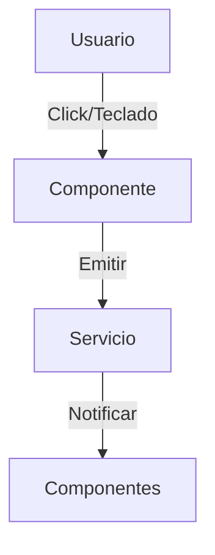
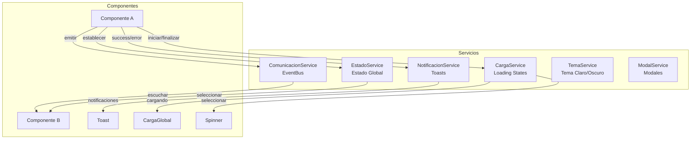
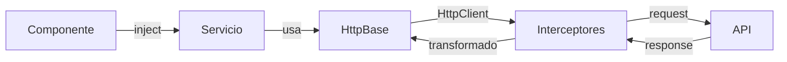
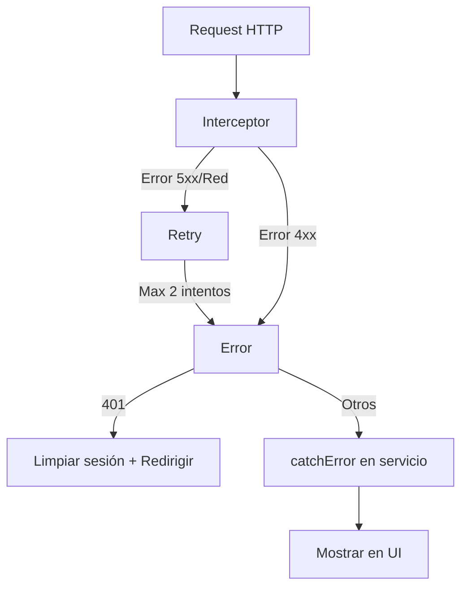

# Documentación Técnica del Cliente - Gymunity

---

## Fase 1: Arquitectura de Eventos

### 1.1 Principios

- **Separación de lógica y presentación:** TypeScript para lógica, SCSS para estilos.
- **Servicios centralizados:** Gestión de eventos globales mediante signals y suscripciones.
- **Accesibilidad:** Eventos de teclado (ESC, TAB, ENTER) para navegación.

### 1.2 Diagrama de Flujo de Eventos



### 1.3 Compatibilidad de Navegadores

| Evento         | Chrome | Firefox | Edge | Safari | Opera |
|----------------|:------:|:-------:|:----:|:------:|:-----:|
| click          |   ✅   |   ✅    |  ✅  |   ✅   |  ✅   |
| keydown        |   ✅   |   ✅    |  ✅  |   ✅   |  ✅   |
| focus/blur     |   ✅   |   ✅    |  ✅  |   ✅   |  ✅   |
| custom events  |   ✅   |   ✅    |  ✅  |   ✅   |  ✅   |

---

## Fase 2: Arquitectura de Servicios

### 2.1 Diagrama de Arquitectura



### 2.2 Servicios Implementados

| Servicio | Responsabilidad | Patrón |
|----------|-----------------|--------|
| `ComunicacionService` | Comunicación entre componentes hermanos | Observable/Subject (EventBus) |
| `EstadoService` | Estado global compartido | Signals + Key-Value Store |
| `NotificacionService` | Notificaciones toast | Signals + Auto-dismiss |
| `CargaService` | Estados de carga global/local | Signals + ID-based tracking |
| `TemaService` | Cambio de tema claro/oscuro | Signals + LocalStorage |
| `ModalService` | Gestión de modales | Signals + Focus trap |

---

## Fase 2: Patrones de Comunicación

### 3.1 Comunicación entre Componentes Hermanos

```typescript
// Componente A - Emisor
this.comunicacionService.emitir('evento-nombre', datos);

// Componente B - Receptor
this.comunicacionService.escuchar<TipoDatos>('evento-nombre')
  .subscribe((datos) => { /* procesar */ });
```

### 3.2 Estado Global Reactivo

```typescript
// Escribir
this.estadoService.establecer('clave', valor);

// Leer (reactivo)
readonly estado = this.estadoService.seleccionar<Tipo>('clave');
// En template: {{ estado() }}
```

### 3.3 Notificaciones Toast

```typescript
this.notificacionService.success('Mensaje de éxito');
this.notificacionService.error('Mensaje de error');
this.notificacionService.warning('Advertencia');
this.notificacionService.info('Información');
```

### 3.4 Loading States

```typescript
// Global
this.cargaService.iniciar();
this.cargaService.finalizar();

// Local (por ID)
this.cargaService.iniciar('boton-guardar');
readonly cargando = this.cargaService.seleccionar('boton-guardar');
```

---

## Fase 2: Separación de Responsabilidades

### 4.1 Principio

| Capa | Responsabilidad | Ejemplos |
|------|-----------------|----------|
| **Componentes** | Solo presentación (template + interacción) | Acordeon, Tabs, Tooltip, Toast |
| **Servicios** | Lógica de negocio y datos | NotificacionService, CargaService |
| **Modelos** | Definición de tipos/interfaces | Notificacion, Evento, Tema |

### 4.2 Ejemplo Práctico

```
❌ INCORRECTO (lógica en componente)
@Component(...)
export class MiComponente {
  notificaciones = [];
  mostrar(msg) { this.notificaciones.push(msg); setTimeout(...) }
}

✅ CORRECTO (lógica en servicio)
@Component(...)
export class MiComponente {
  private notificacionService = inject(NotificacionService);
  mostrar(msg) { this.notificacionService.success(msg); }
}
```

### 4.3 Buenas Prácticas

1. **Componentes sin estado de negocio:** Solo manejan `@Input`, `@Output` y estado de UI local.
2. **Servicios `providedIn: 'root'`:** Singleton global, inyección automática.
3. **Signals para reactividad:** Evitar `BehaviorSubject` cuando signals es suficiente.
4. **Suscripciones gestionadas:** Usar `takeUntilDestroyed()` o `OnDestroy` + `unsubscribe()`.
5. **Tipado estricto:** Interfaces para todos los datos compartidos.

---

## Fase 3: Manipulación del DOM

### 5.1 Acceso a Elementos con ViewChild

```typescript
// Acceder a elementos del DOM
@ViewChild('menuNav') menuNav!: ElementRef<HTMLElement>;
@ViewChild('botonCerrar') botonCerrar!: ElementRef<HTMLButtonElement>;

// Uso en métodos
this.menuNav.nativeElement.contains(elemento);
this.botonCerrar.nativeElement.focus();
```

### 5.2 Creación Dinámica de Elementos

```typescript
// Tooltip crea elementos dinámicamente
private readonly renderer = inject(Renderer2);
private readonly documento = inject(DOCUMENT);

crearElemento(): void {
  const elemento = this.renderer.createElement('div');
  this.renderer.addClass(elemento, 'tooltip');
  this.renderer.appendChild(this.documento.body, elemento);
}
```

### 5.3 Modificación de Estilos

```typescript
// Bloquear scroll del body
this.documento.body.style.overflow = 'hidden';

// Aplicar tema dinámicamente
document.documentElement.setAttribute('data-tema', tema);
```

---

## Fase 4: Componentes Interactivos

### 6.1 Implementaciones

| Componente | Funcionalidades |
|------------|-----------------|
| **Header (Menú)** | Abrir/cerrar con animación, cerrar con ESC, cerrar al click fuera |
| **VentanaEmergente** | Abrir/cerrar, cerrar con ESC, focus trap, click en overlay |
| **Acordeon** | Expandir/colapsar secciones, modo único, navegación por teclado |
| **Tabs** | Cambiar pestañas, navegación con flechas, Home/End |
| **Tooltip** | Mostrar/ocultar al hover, posicionamiento dinámico, retraso configurable |
| **Toast** | Auto-dismiss, cierre manual, animaciones de entrada/salida |

### 6.2 Eventos de Teclado Implementados

| Tecla | Componente | Acción |
|-------|------------|--------|
| `ESC` | Modal, Header, Toast | Cerrar |
| `Enter/Space` | Acordeon | Alternar expansión |
| `ArrowLeft/Right` | Tabs | Navegar entre pestañas |
| `Home/End` | Tabs | Ir a primera/última pestaña |
| `Tab` | Modal | Focus trap interno |

---

## Fase 5: Estructura de Componentes

### 7.1 Organización de Archivos

Cada componente sigue la estructura:

```
componente/
├── componente.ts      # Lógica y decoradores
├── componente.html    # Template
└── componente.scss    # Estilos (usando variables SCSS)
```

### 7.2 Uso de Variables SCSS

```scss
@use '../../../../styles/00-settings/variables' as *;

.componente {
  padding: $space-2;                    // Espaciado
  font-size: $texto-sm;                 // Tipografía
  border-radius: $radio-lg;             // Bordes
  color: var(--color-texto);            // Colores (tema)
  box-shadow: $shadow-md;               // Sombras
}
```

### 7.3 Escala de Z-Index

| Nivel | Z-Index | Uso |
|-------|---------|-----|
| Base | 0 | Contenido normal |
| Backdrop | 1 | Overlays de fondo |
| Header | 2 | Navegación fija |
| Navegación móvil | 2 | Menú hamburguesa |
| Modal | 3 | Ventanas emergentes |
| Loading global | 4 | Indicador de carga |
| Toast | 5 | Notificaciones |

---

## Fase 8: Sistema de Formularios Reactivos

### 8.1 Arquitectura

Sistema de formularios con Angular Reactive Forms que incluye validadores síncronos, asíncronos y retroalimentación visual en tiempo real.

### 8.2 Catálogo de Validadores

**Síncronos:**
- `passwordFuerte`: Mayúsculas, minúsculas, números y caracteres especiales (@$!%*?&.)
- `coincidenCampos`: Validación cruzada entre dos campos
- `nifValido`: NIE/NIF/CIF español con letra de control
- `telefonoEspanol`: Teléfono español (9 dígitos, +34)
- `codigoPostalEspanol`: CP español (01000-52999)
- `rangoNumerico`: Valor dentro de un rango

**Asíncronos (debounce 500ms):**
- `emailUnico`: Verifica disponibilidad en BD
- `usernameUnico`: Verifica disponibilidad en BD

```typescript
// Ejemplo de uso
this.formulario = this.fb.group({
  username: ['', [Validators.required], [this.validadoresAsincronos.usernameUnico()]],
  password: ['', [Validators.required, this.validadores.passwordFuerte()]]
});
```

### 8.3 Retroalimentación Visual

Estados: **Error** (rojo), **Validando** (spinner azul), **Éxito** (verde).

### 8.4 Indicador de Fuerza de Contraseña

Calcula fortaleza: longitud incremental (45pts: 8+=15, 12+=10, 16+=10, 20+=10), minúsculas (15pts), mayúsculas (15pts), números (15pts), caracteres especiales (15pts).

Niveles: Débil (0-39%), Media (40-64%), Fuerte (65-84%), Muy Fuerte (85-100%).

### 8.5 FormArray - Edición de Perfil

El `formulario-perfil` implementa FormArray para redes sociales con campos dinámicos:

```typescript
// Añadir elemento dinámicamente
agregarRedSocial(): void {
  const grupo = this.fb.group({
    plataforma: ['Instagram', [Validators.required]],
    url: ['', [Validators.required, Validators.pattern(/^https?:\/\/.+/)]]
  });
  this.redesSocialesArray.push(grupo);
}

// Eliminar elemento
eliminarRedSocial(index: number): void {
  this.redesSocialesArray.removeAt(index);
}
```

Campos del formulario: nombre, apellidos, username (async), email (readonly), teléfono, código postal, bio, redes sociales (FormArray).

---

## Fase 4: Sistema de Rutas y Navegación

### 4.1 Configuración de Rutas

**8 rutas principales implementadas:**

| Ruta | Componente | Lazy Loading | Guard | Resolver | Breadcrumb |
|------|-----------|--------------|-------|----------|------------|
| `/` | Inicio | ✅ | ❌ | ❌ | "Inicio" |
| `/busqueda` | Busqueda | ✅ | ❌ | ❌ | "Búsqueda" |
| `/gimnasio/:id` | GimnasioDetalle | ✅ | ❌ | ✅ | "Gimnasio" |
| `/perfil` | Perfil | ✅ | ✅ CanActivate | ✅ CanDeactivate | "Mi Perfil" |
| `/configuracion` | Configuracion | ✅ | ✅ CanActivate | ✅ CanDeactivate | "Configuración" |
| `/guia-estilo` | GuiaEstilo | ✅ | ❌ | ❌ | "Guía de Estilo" |
| `/pruebas` | Pruebas | ✅ | ❌ | ❌ | "Pruebas" |
| `/**` | NoEncontrada | ✅ | ❌ | ❌ | - |

**Archivo:** `frontend/src/app/app.routes.ts`

#### Rutas con Parámetros

```typescript
// Ruta dinámica con parámetro ID
/gimnasio/:id

// Ejemplos:
/gimnasio/1   → Carga gimnasio ID 1
/gimnasio/999 → Carga gimnasio ID 999
/gimnasio/abc → Redirige a 404
```

#### Wildcard (404)

```typescript
{
  path: '**',
  loadComponent: () => import('./paginas/no-encontrada/no-encontrada')
    .then((m) => m.NoEncontrada),
}
```

**IMPORTANTE:** La ruta wildcard `**` debe ir **SIEMPRE AL FINAL** del array.

### 4.2 Lazy Loading

**Estrategia:** `PreloadAllModules` configurada en `app.config.ts`

```typescript
export const appConfig: ApplicationConfig = {
  providers: [
    provideRouter(
      routes,
      withPreloading(PreloadAllModules) // ← Precarga automática
    ),
  ],
};
```

**Ventajas:**
- ✅ Carga inicial rápida (~125 KB)
- ✅ Precarga automática en background
- ✅ Navegación instantánea
- ✅ Óptimo para apps pequeñas/medianas

**Verificación en build:**

```bash
cd frontend
npm run build

# Output esperado:
# main.[hash].js        → Bundle principal
# chunk-[hash].js       → Cada ruta genera su chunk
# polyfills.[hash].js   → Polyfills
```

### 4.3 Route Guards

#### autenticacionGuard (CanActivate)

**Archivo:** `frontend/src/app/guards/autenticacion.guard.ts`

**Propósito:** Proteger rutas que requieren autenticación.

```typescript
export const autenticacionGuard: CanActivateFn = (route, state) => {
  const autenticacionService = inject(AutenticacionService);
  const router = inject(Router);
  
  const estaAutenticado = autenticacionService.estaAutenticado();
  
  return estaAutenticado ? true : router.createUrlTree(['/']);
};
```

**Rutas protegidas:**
- `/perfil` → Redirige a `/` si no autenticado
- `/configuracion` → Redirige a `/` si no autenticado

**Flujo:**
1. Usuario intenta acceder a `/perfil`
2. Guard verifica `estaAutenticado()`
3. Si `true` → permite acceso
4. Si `false` → redirige a `/`

#### cambiosSinGuardarGuard (CanDeactivate)

**Archivo:** `frontend/src/app/guards/cambios-sin-guardar.guard.ts`

**Propósito:** Prevenir pérdida de datos en formularios.

```typescript
export const cambiosSinGuardarGuard: CanDeactivateFn<ComponenteConCambios> = 
  (component) => {
    const tieneCambios = component.tieneCambiosSinGuardar();
    
    return tieneCambios ? confirm(MENSAJE_CONFIRMACION) : true;
  };
```

**Componentes protegidos:**
- `Perfil` → Implementa `ComponenteConCambios`
- `Configuracion` → Implementa `ComponenteConCambios`

**Flujo:**
1. Usuario modifica formulario
2. Intenta salir sin guardar
3. Guard muestra confirmación
4. Confirmar → permite salida
5. Cancelar → permanece en ruta

### 4.4 Resolvers

#### gimnasioResolver

**Archivo:** `frontend/src/app/resolvers/gimnasio.resolver.ts`

**Propósito:** Precargar datos del gimnasio **ANTES** de activar la ruta.

```typescript
export const gimnasioResolver: ResolveFn<Gimnasio> = (route, state) => {
  const router = inject(Router);
  const id = obtenerIdDeRuta(route);
  
  if (id === null) return EMPTY;
  
  return of(crearGimnasioSimulado(id)).pipe(delay(DELAY_SIMULADO));
};
```

**Características:**
- **Delay simulado:** 800ms (simula llamada HTTP)
- **Validación ID:** Verifica parámetro numérico
- **Redirección:** ID inválido → `/404`
- **Datos simulados:** Gimnasio ficticio basado en ID

**Uso en componente:**

```typescript
ngOnInit(): void {
  this.route.data.subscribe((data) => {
    this.gimnasio.set(data['gimnasio'] as Gimnasio);
    this.cargando.set(false);
  });
}
```

### 4.5 Breadcrumbs Dinámicos

**Archivo:** `frontend/src/app/componentes/compartidos/breadcrumbs/breadcrumbs.ts`

**Propósito:** Generar navegación automática desde configuración de rutas.

```typescript
export class Breadcrumbs {
  readonly breadcrumbs: Signal<Breadcrumb[]> = toSignal(this.navigationEnd$, {
    initialValue: this.construirBreadcrumbs(this.activatedRoute.root),
  });
  
  readonly mostrarBreadcrumbs: Signal<boolean> = computed(() => 
    this.breadcrumbs().length > 1
  );
}
```

**Generación automática:**

Los breadcrumbs se generan desde `data.breadcrumb` de cada ruta:

```typescript
// app.routes.ts
{
  path: 'gimnasio/:id',
  data: { breadcrumb: 'Gimnasio' }, // ← Se usa para breadcrumb
}
```

**Ejemplos:**
- Ruta `/gimnasio/5` → Breadcrumbs: `Inicio → Gimnasio`
- Ruta `/configuracion` → Breadcrumbs: `Inicio → Configuración`

### 4.6 Navegación Programática

#### Desde Servicios

```typescript
// autenticacion.ts
logout(): void {
  this.usuario.set(null);
  this.router.navigate(['/']); // ← Navegación programática
}
```

#### Pasar Parámetros

```typescript
// Con parámetros de ruta
this.router.navigate(['/gimnasio', 5]);
// Resultado: /gimnasio/5

// Query params
this.router.navigate(['/busqueda'], {
  queryParams: { ciudad: 'Madrid', tipo: 'premium' }
});
// Resultado: /busqueda?ciudad=Madrid&tipo=premium

// Fragment
this.router.navigate(['/gimnasio', 5], {
  fragment: 'horarios'
});
// Resultado: /gimnasio/5#horarios
```

#### NavigationExtras

```typescript
this.router.navigate(['/perfil'], {
  state: { mensaje: 'Perfil actualizado' }
});

// En componente destino:
const state = this.router.getCurrentNavigation()?.extras.state;
console.log(state?.['mensaje']); // 'Perfil actualizado'
```

### 4.7 Cómo Probar

#### Iniciar Aplicación

```bash
cd frontend
npm install  # Solo primera vez
npm start    # Abre http://localhost:4200
```

#### Probar Lazy Loading

1. Abre DevTools → pestaña **Network**
2. Navega: Inicio → Búsqueda → Gimnasio
3. **Verifica:** Aparecen `chunk-[hash].js` en Network
4. **Resultado:** Solo descarga chunk necesario

#### Probar PreloadAllModules

1. Carga inicial en `/`
2. Espera 2-3 segundos (sin navegar)
3. Network → todos los chunks se precargan
4. Navega → carga instantánea

#### Probar autenticacionGuard

**Usuario NO autenticado:**
```
1. Ir a http://localhost:4200
2. Acceder a /perfil manualmente
3. ✅ Redirige a /
```

**Usuario autenticado:**
```
1. Hacer login (cualquier email/password)
2. Navegar a /perfil
3. ✅ Acceso permitido
```

#### Probar cambiosSinGuardarGuard

```
1. Login → ir a /configuracion
2. Click "Simular cambio"
3. Intentar salir
4. ✅ Aparece: "¿Seguro que quieres salir sin guardar?"
5. Cancelar → permanece
6. Aceptar → sale
```

#### Probar gimnasioResolver

```
1. Ir a /gimnasio/5
2. ✅ Loading state ~800ms
3. ✅ Datos: "Gimnasio Premium 5"
4. ✅ Servicios cargados

ID inválido:
1. Ir a /gimnasio/abc
2. ✅ Redirige a /404
```

#### Probar Breadcrumbs

```
1. Navega a /gimnasio/5
2. ✅ Header: "Inicio → Gimnasio"
3. Click "Inicio" → navega a /
4. Ve a /configuracion
5. ✅ Header: "Inicio → Configuración"
```

#### Probar Wildcard 404

```
1. Ir a /ruta-que-no-existe
2. ✅ Página 404 con emoji 🏋️
3. ✅ Botón "Volver al inicio"
```

#### Build Production

```bash
cd frontend
npm run build

# Verifica output en dist/frontend/browser/:
# ├── main.[hash].js
# ├── chunk-[hash].js  ← Múltiples chunks
# ├── polyfills.[hash].js
# └── index.html
```

### 4.8 Estructura de Archivos

```
frontend/src/app/
├── app.routes.ts                    ← Configuración principal
├── app.config.ts                    ← PreloadAllModules
├── guards/
│   ├── autenticacion.guard.ts       ← CanActivate
│   └── cambios-sin-guardar.guard.ts ← CanDeactivate
├── resolvers/
│   └── gimnasio.resolver.ts         ← Precarga datos
├── servicios/
│   └── autenticacion.ts             ← Servicio auth
├── componentes/compartidos/
│   └── breadcrumbs/                 ← Breadcrumbs dinámicos
└── paginas/
    ├── inicio/
    ├── busqueda/
    ├── gimnasio/                    ← Usa resolver
    ├── perfil/                      ← Usa guards
    ├── configuracion/               ← Usa guards
    └── no-encontrada/               ← 404
```

### 4.9 Resumen de Cumplimiento

| Criterio | Estado | Evidencia |
|----------|--------|-----------||
| Rutas principales | ✅ | 8 rutas configuradas |
| Rutas con parámetros | ✅ | `/gimnasio/:id` |
| Rutas hijas anidadas | ✅ | Estructura modular |
| Ruta wildcard 404 | ✅ | `path: '**'` al final |
| Navegación programática | ✅ | `Router.navigate()` |
| Query params | ✅ | Soportado en búsqueda |
| Lazy Loading | ✅ | `loadComponent` en todas |
| PreloadAllModules | ✅ | Configurado en app.config |
| Build production | ✅ | Chunks verificables |
| CanActivate | ✅ | autenticacionGuard |
| Autenticación simulada | ✅ | localStorage |
| CanDeactivate | ✅ | cambiosSinGuardarGuard |
| Resolver | ✅ | gimnasioResolver |
| Loading state | ✅ | Signal `cargando` |
| Manejo errores | ✅ | Redirección 404 |
| Breadcrumbs dinámicos | ✅ | Componente signals |
| Documentación | ✅ | Esta sección |

### 4.10 Criterios RA7

#### RA7.g - Gestión del Estado

✅ **Implementado:**
- Signals para estado reactivo
- Persistencia en localStorage
- Estado compartido entre componentes

#### RA7.h - Enrutamiento y Navegación

✅ **Implementado:**
- Sistema completo de rutas con lazy loading
- Guards de autenticación y confirmación
- Resolvers para precarga de datos
- Breadcrumbs dinámicos
- Navegación programática
- Manejo de errores (404)

### 4.11 Buenas Prácticas Aplicadas

1. **Lazy Loading:** Todas las rutas optimizadas
2. **PreloadAllModules:** Balance UX/Performance
3. **Guards funcionales:** Más simple que class-based
4. **Single return:** Una salida por función
5. **Constantes extraídas:** Mantenibilidad
6. **Signals:** Reactividad moderna
7. **Semantic HTML:** Sin `<div>`
8. **Z-index mínimo:** Jerarquía 1-4
9. **Sin !important:** CSS limpio
10. **TypeScript estricto:** Tipos explícitos

---

## Fase 5: Sistema HTTP y Consumo de API

### 5.1 Arquitectura HTTP



### 5.2 Catálogo de Endpoints

**Base URL:** `/api`

| Método | Endpoint | Descripción | Servicio |
|--------|----------|-------------|----------|
| POST | `/auth/login` | Iniciar sesión | AuthService |
| POST | `/auth/register` | Registrar usuario | AuthService |
| GET | `/gimnasios` | Listar gimnasios | GimnasiosApiService |
| GET | `/gimnasios/populares` | Gimnasios populares | GimnasiosApiService |
| GET | `/gimnasios/recientes` | Gimnasios recientes | GimnasiosApiService |
| GET | `/gimnasios/:id` | Detalle gimnasio | GimnasiosApiService |
| GET | `/gimnasios/buscar` | Buscar gimnasios | GimnasiosApiService |
| POST | `/gimnasios` | Crear gimnasio | GimnasiosApiService |
| PUT | `/gimnasios/:id` | Actualizar gimnasio | GimnasiosApiService |
| DELETE | `/gimnasios/:id` | Eliminar gimnasio | GimnasiosApiService |

### 5.3 Estructura de Datos (Interfaces)

**Archivo:** `frontend/src/app/modelos/index.ts`

```typescript
// Usuario
interface Usuario {
  id: number;
  nombreUsuario: string;
  email: string;
  rol: 'ALUMNO' | 'PROFESOR' | 'ADMIN';
  ciudad?: string;
}

// Autenticación
interface LoginRequest { email: string; contrasenia: string; }
interface RegistroRequest { nombreUsuario: string; email: string; contrasenia: string; ciudad: string; rol: string; }
interface AuthResponse { token: string; email: string; nombreUsuario: string; rol: string; id: number; mensaje: string; }

// Gimnasio
interface GimnasioCard { id: number; nombre: string; ciudad: string; foto: string; disciplinas: string; valoracionMedia: number | null; totalResenias: number; }
interface GimnasioDetalle { id: number; nombre: string; descripcion: string; ciudad: string; foto: string; clases: Clase[]; resenias: Resenia[]; valoracionMedia: number | null; totalResenias: number; totalApuntados: number; }
interface GimnasioRequest { nombre: string; descripcion: string; ciudad: string; foto?: string; }

// Clase
interface Clase { id: number; nombre: string; icono: string; profesorNombre: string; gimnasioId: number; }

// Reseña
interface Resenia { id: number; texto: string; usuarioNombre: string; fechaInteraccion: string; }

// Error API
interface ErrorApi { mensaje: string; codigo: number; timestamp?: string; }
```

### 5.4 Servicio HTTP Base

**Archivo:** `frontend/src/app/servicios/http-base.ts`

Servicio centralizado con operaciones CRUD:

```typescript
// GET - Obtener recursos
get<T>(url: string, opciones?: OpcionesHttp): Observable<T>

// POST - Crear recursos
post<T, D>(url: string, datos: D, opciones?: OpcionesHttp): Observable<T>

// PUT - Actualizar completo
put<T, D>(url: string, datos: D, opciones?: OpcionesHttp): Observable<T>

// PATCH - Actualizar parcial
patch<T, D>(url: string, datos: D, opciones?: OpcionesHttp): Observable<T>

// DELETE - Eliminar
delete<T>(url: string, opciones?: OpcionesHttp): Observable<T>

// UPLOAD - Archivos con FormData
upload<T>(url: string, formData: FormData, opciones?: OpcionesHttp): Observable<T>

// GET paginado con filtros
getPaginado<T>(url: string, filtros?: QueryParams, paginacion?: OpcionesPaginacion): Observable<T>
```

### 5.5 Interceptores HTTP

**Archivo:** `frontend/src/app/app.config.ts`

```typescript
provideHttpClient(
  withFetch(),
  withInterceptors([
    httpLoggingInterceptor,   // 1º - Log requests/responses
    httpHeadersInterceptor,   // 2º - Añade headers
    httpErrorInterceptor      // 3º - Maneja errores
  ])
)
```

#### httpHeadersInterceptor

**Archivo:** `frontend/src/app/interceptors/http-headers.interceptor.ts`

- Añade `Content-Type: application/json`
- Añade `Accept: application/json`
- Añade `Authorization: Bearer {token}` si existe

#### httpErrorInterceptor

**Archivo:** `frontend/src/app/interceptors/http-error.interceptor.ts`

- **Retry automático:** 2 reintentos para errores 5xx y errores de red
- **Backoff exponencial:** 1s, 2s entre reintentos
- **No reintentar:** 400, 401, 403, 404, 422
- **401:** Limpia sesión y redirige a `/`
- **Logging:** Console.error con detalles

#### httpLoggingInterceptor

**Archivo:** `frontend/src/app/interceptors/http-logging.interceptor.ts`

- Log de requests (método, URL, headers, body)
- Log de responses (status, duración, body)
- Log de errores con duración
- Colores: Azul (request), Verde (success), Rojo (error)

### 5.6 Estrategia de Manejo de Errores



**Capas de manejo:**

1. **Interceptor:** Retry automático + logout en 401
2. **HttpBase:** `catchError` + transformación a `ErrorApi`
3. **Servicio:** Estado de error en signal + mensaje usuario
4. **Componente:** Muestra error con `NotificacionService`

**Ejemplo en servicio:**

```typescript
obtenerTodos(): Observable<GimnasioCard[]> {
  this._cargando.set(true);
  this._error.set(null);

  return this.http.get<GimnasioCard[]>(API_URL).pipe(
    tap((gimnasios) => this._gimnasios.set(gimnasios)),
    finalize(() => this._cargando.set(false)),
    catchError((error) => {
      this._error.set(error.mensaje || 'Error al cargar');
      return of([]);
    })
  );
}
```

### 5.7 Estados de UI

| Estado | Signal | UI |
|--------|--------|-----|
| Cargando | `cargando()` | Spinner/Skeleton |
| Error | `error()` | Mensaje + Reintentar |
| Vacío | `hayGimnasios()` | Empty state ilustrado |
| Éxito | Datos en signal | Lista/Detalle |

### 5.8 Resumen de Cumplimiento HTTP

| Criterio | Estado | Evidencia |
|----------|--------|-----------|
| HttpClient configurado | ✅ | `provideHttpClient()` |
| Servicio base HTTP | ✅ | `HttpBase` |
| Interceptores headers | ✅ | `httpHeadersInterceptor` |
| Interceptor errores | ✅ | `httpErrorInterceptor` |
| Interceptor logging | ✅ | `httpLoggingInterceptor` |
| GET listados | ✅ | `obtenerTodos()` |
| GET individual | ✅ | `obtenerPorId(id)` |
| POST crear | ✅ | `crear(datos)` |
| PUT actualizar | ✅ | `actualizar(id, datos)` |
| DELETE eliminar | ✅ | `eliminar(id)` |
| Tipado respuestas | ✅ | Interfaces en `modelos/` |
| map/catchError | ✅ | En todos los métodos |
| Retry logic | ✅ | 2 reintentos, backoff |
| FormData upload | ✅ | `upload()` en HttpBase |
| Query params | ✅ | `getPaginado()` |
| Loading state | ✅ | Signal `cargando` |
| Error state | ✅ | Signal `error` |
| Empty state | ✅ | Signal computed |
| Success feedback | ✅ | `NotificacionService` |
