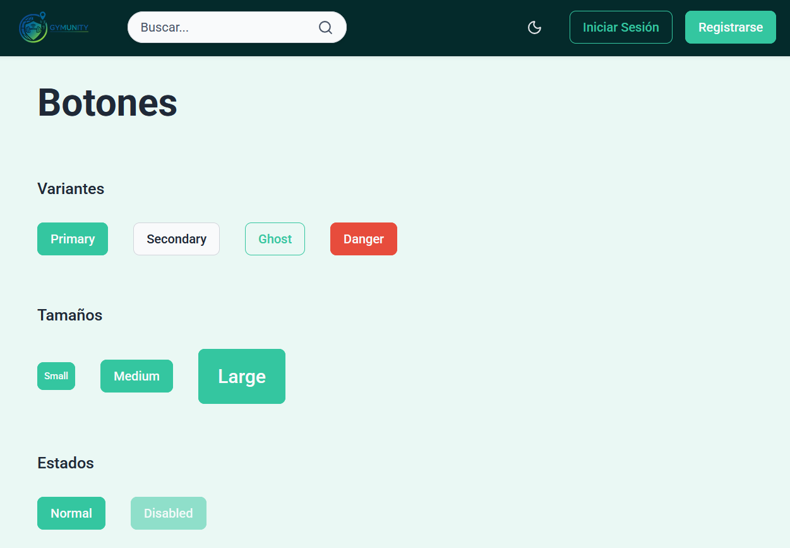
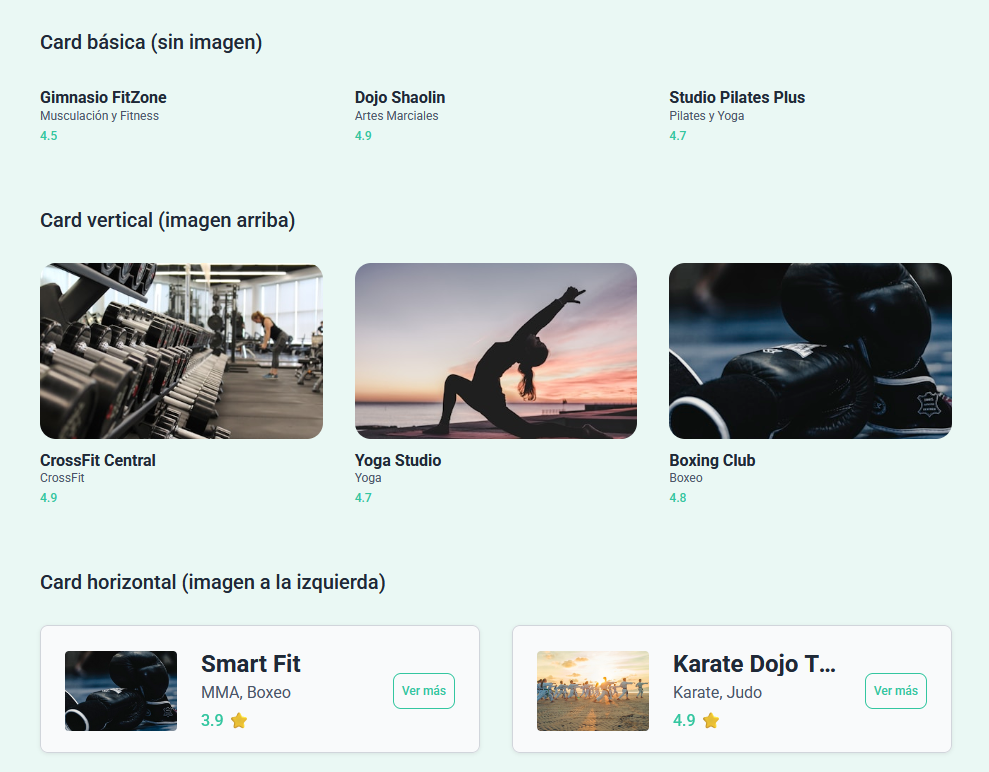
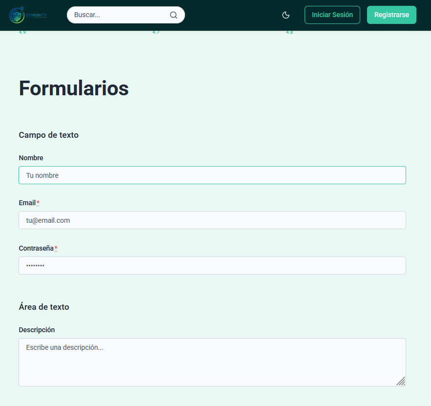
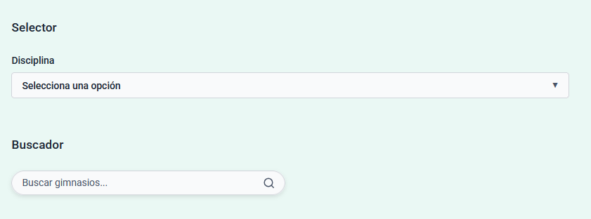

# Documentación de Diseño - Gymunity

## Índice

### 1. Fundamentos de diseño
- [1.1 Principios de comunicación visual](#11-principios-de-comunicación-visual)
  - Jerarquía
  - Contraste
  - Alineación
  - Proximidad
  - Repetición
- [1.2 Metodología CSS](#12-metodología-css)
- [1.3 Organización de archivos](#13-organización-de-archivos)
- [1.4 Sistema de Design Tokens](#14-sistema-de-design-tokens)
  - Variables y utilidades de diseño

### 2. HTML semántico y estructura
- [2.1 Elementos semánticos utilizados](#21-elementos-semánticos-utilizados)
- [2.2 Jerarquía de headings](#22-jerarquía-de-headings)
- [2.3 Estructura de formularios](#23-estructura-de-formularios)

### 3. Sistema de componentes UI
- [3.1 Componentes implementados](#31-componentes-implementados)
  - Botón
  - Alerta
  - Notificación
  - Card
  - Campo de formulario
  - Área de texto
  - Selector
  - Buscador
  - Botón tema
  - Ventana emergente
  - Icono
  - Sección bienvenida
- [3.2 Nomenclatura y metodología BEM](#32-nomenclatura-y-metodología-bem)
- [3.3 Style Guide](#33-style-guide)
  - Botones
  - Alertas
  - Notificaciones
  - Cards
  - Formularios
  - Buscador
  - Tema

---

## 1.1 Principios de comunicación visual

Los cinco principios básicos de comunicación visual ayudan a crear interfaces claras y efectivas:

**Jerarquía:** Consiste en organizar los elementos visuales según su importancia. Se logra usando diferentes tamaños, pesos de fuente y espaciado, guiando la atención del usuario hacia lo más relevante primero.


**Contraste:** Permite diferenciar elementos y destacar información clave. Se utiliza el color, el tamaño y el peso visual para que ciertos componentes resalten y sean fácilmente identificables.


**Alineación:** Es la disposición ordenada de los elementos en la interfaz. Una buena alineación, ya sea a la izquierda, centrada o en cuadrícula, aporta estructura y facilita la lectura.


**Proximidad:** Agrupa elementos relacionados mediante el uso del espacio. Cuando los objetos están cerca entre sí, el usuario los percibe como parte de un mismo grupo, lo que mejora la comprensión.


**Repetición:** Consiste en reutilizar patrones visuales, colores y estilos a lo largo del diseño. Esto genera coherencia y refuerza la identidad visual del proyecto.


## 1.2 Metodología CSS

Para este proyecto se utiliza la metodología BEM (Bloque, Elemento, Modificador) en la nomenclatura de clases CSS. BEM ayuda a mantener el código organizado, claro y fácil de escalar, evitando confusiones y estilos globales.

- **Bloques:** Representan componentes principales, por ejemplo: `.gym-grid`
- **Elementos:** Partes internas del bloque, por ejemplo: `.gym-grid__item`
- **Modificadores:** Variantes o estados, por ejemplo: `.gym-grid--section`

**Ejemplo:**
```scss
.gym-grid {
  /* estilos del bloque */
}
.gym-grid__item {
  /* estilos del elemento */
}
.gym-grid--section {
  /* estilos del modificador */
}
```

Esta metodología facilita la lectura y el mantenimiento del CSS en proyectos grandes o colaborativos.

## 1.3 Organización de archivos

El orden de las carpetas va de estilos más generales a más específicos. Así, las variables y herramientas se cargan primero, seguidos por resets, estilos base, layouts, componentes y utilidades. Esto evita conflictos y hace que el código sea más fácil de mantener y entender.

**Árbol de carpetas:**
```
styles/
├── 00-settings/
│   └── _variables.scss
├── 01-tools/
│   └── _mixins.scss
├── 02-generic/
│   └── _reset.scss
├── 03-elements/
│   └── _elements.scss
├── 04-layout/
│   └── _layout.scss
├── 05-components/
├── 06-utilities/
└── main.scss
```

## 1.4 Sistema de Design Tokens

Las variables definen los valores clave del diseño y ayudan a mantener la coherencia visual. Aquí se agrupan y se explican las decisiones principales:

**Colores:**
Se eligieron tonos verdes y azules para transmitir frescura y confianza, junto con grises neutros para equilibrio y legibilidad. Los colores semánticos (éxito, error, advertencia) facilitan la comunicación visual de estados.

**Tipografía:**
La fuente principal utilizada es 'Roboto', una tipografía moderna y legible que se adapta bien a interfaces web. Se acompaña de Arial y sans-serif como alternativas seguras en caso de que Roboto no esté disponible.

### Variables y utilidades de diseño

**00-settings/_variables.scss**

**Colores principales (modo claro):**
- `$color-header`: #042A2B (fondo del header)
- `$color-hover-header`: #063B3D (hover del header)
- `$color-fondo`: #EAF8F4 (fondo general de la aplicación)
- `$color-buscador-bg`: #FAFCFB (fondo del buscador)
- `$color-buscador-hover`: #E8F5F1 (hover del buscador)
- `$color-buscador-focus`: #F5FAF8 (focus del buscador)
- `$color-buscador-borde`: #34C6A0 (borde del buscador)

**Colores modo oscuro:**
- `$oscuro-fondo`: #0F1C1C (fondo principal oscuro)
- `$oscuro-fondo-secundario`: #1A2D2D (fondo secundario)
- `$oscuro-header`: #081414 (header oscuro)
- `$oscuro-texto`: #F0FAF7 (texto principal)
- `$oscuro-subtitulo`: #8EC5B5 (texto secundario)
- `$oscuro-borde`: #2D4A4A (bordes)
- `$oscuro-boton`: #00E5A0 (botones vibrantes)
- `$oscuro-boton-hover`: #00CC8E (hover de botones)
- `$oscuro-exito`, `$oscuro-error`, `$oscuro-warning`, `$oscuro-info`: colores semánticos adaptados
- `$oscuro-shadow-*`: sombras con efecto glow verde

**Colores secundarios:**
- `$color-botones`: #34C6A0 (color principal de botones)
- `$color-botones-hover`: #2AAE8E (hover de botones)
- `$color-botones-active`: #0C5649 (estado activo de botones)
- `$shadow-boton`: sombra para botones
- `$shadow-boton-hover`: sombra para botones en hover

**Colores semánticos:**
- `$color-exito`: #2ECC71 (éxito/confirmación)
- `$color-error`: #E74C3C (error/peligro)
- `$color-warning`: #FFA726 (advertencia)
- `$color-info`: #1976D2 (información)

**Colores neutros (grises):**
- `$gris-50` a `$gris-900`: escala de grises para fondos, textos y bordes

**Colores para texto:**
- `$color-text`: color principal del texto (usa `$gris-800`)
- `$color-subtitulo`: #4A5568 (subtítulos y texto secundario)

**Tipografía:**
- `$fuente-principal`: 'Roboto', Arial, sans-serif

**Tamaños de texto:**
- `$texto-xxs`: 0.5rem, `$texto-xs`: 0.75rem, `$texto-s`: 1rem
- `$texto-m`: 1.5rem, `$texto-l`: 2rem, `$texto-xl`: 2.5rem
- `$texto-2xl`: 3rem, `$texto-3xl`: 3.5rem, `$texto-4xl`: 4rem, `$texto-5xl`: 5rem

**Pesos tipográficos:**
- `$font-weight-thin`: 100, `$font-weight-light`: 300, `$font-weight-regular`: 400
- `$font-weight-medium`: 500, `$font-weight-bold`: 700

**Alturas de línea:**
- `$line-height-tight`: 1.1, `$line-height-normal`: 1.5, `$line-height-relaxed`: 1.75

**Espaciado (base 8px):**
- `$space-1` a `$space-12`: desde 0.5rem hasta 6rem

**Breakpoints:**
- `$breakpoint-sm`: 640px, `$breakpoint-md`: 768px
- `$breakpoint-lg`: 1024px, `$breakpoint-xl`: 1280px

**Sombras:**
- `$shadow-sm`, `$shadow-md`, `$shadow-lg`, `$shadow-xl`: sombras de diferentes intensidades
- `$shadow-buscador`: sombra específica para el componente buscador

**Bordes:**
- `$borde-thin`: 1px, `$borde-medium`: 2px, `$borde-thick`: 4px

**Radios de borde:**
- `$radio-sm`: 2px, `$radio-md`: 4px, `$radio-lg`: 8px
- `$radio-xl`: 16px, `$radio-full`: 9999px (círculo completo)

**01-tools/_mixins.scss**
- `respond-to($breakpoint)`: Mixin para media queries
- `flex-center`: Mixin para centrar con flexbox
- `box-shadow($shadow)`: Mixin para aplicar sombra

**02-generic/_reset.scss**
- Reset global de márgenes, paddings y box-sizing
- Normalización de estilos base para `html`, `body`, imágenes, inputs, listas y enlaces

**03-elements/_elements.scss**
- Estilos base para títulos (`h1`, `h2`, ...), párrafos, subtítulos, enlaces, listas, imágenes y botones
- Uso de variables para colores, tipografía y espaciado

**04-layout/_layout.scss**
- Sistema de grid con clases BEM: `.gym-grid`, `.gym-grid__row`, `.gym-grid__item`, `.gym-grid--section`
- Uso de variables para espaciado, color y radios

**05-components/** y **06-utilities/**
- Actualmente vacías, reservadas para componentes específicos y utilidades futuras

Cada archivo y variable está pensado para mantener la coherencia visual y facilitar el mantenimiento del proyecto.

---

## 2. HTML semántico y estructura

### 2.1 Elementos semánticos utilizados

Se utilizan elementos HTML5 semánticos para mejorar la accesibilidad y el SEO:

| Elemento | Uso | Ejemplo en el proyecto |
|----------|-----|------------------------|
| `<header>` | Cabecera principal con logo, buscador y navegación | Layout header |
| `<nav>` | Navegación y enlaces de redes sociales | Header y footer |
| `<main>` | Contenido principal de la página | Layout main |
| `<section>` | Agrupación de contenido relacionado | Contenedores internos |
| `<article>` | Contenido independiente (marca, contacto) | Footer brand/contacto |
| `<footer>` | Pie de página con información de contacto | Layout footer |
| `<search>` | Área de búsqueda (HTML5.2) | Buscador en header |

**Ejemplo de header:**
```html
<header class="gym-header">
  <section class="gym-header__container">
    <a class="gym-header__logo" routerLink="/">
      
    </a>
    <search class="gym-header__buscador">
      <app-buscador placeholder="Buscar..."></app-buscador>
    </search>
    <nav class="gym-header__utils">
      <app-boton-tema></app-boton-tema>
      <app-boton>Iniciar Sesión</app-boton>
    </nav>
  </section>
</header>
```

**Ejemplo de main:**
```html
<main class="gym-main">
  <ng-content></ng-content>
</main>
```

**Ejemplo de footer:**
```html
<footer class="gym-footer">
  <section class="gym-footer__container">
    <article class="gym-footer__brand">
      
      <p class="gym-footer__slogan">Conecta con los mejores gimnasios...</p>
    </article>
    <article class="gym-footer__contacto">
      <nav class="gym-footer__social" aria-label="Redes sociales">
        <!-- Enlaces de las redes sociales -->
      </nav>
    </article>
  </section>
  <p class="gym-footer__copyright">© 2025 Gymunity</p>
</footer>
```

### 2.2 Jerarquía de headings

**Reglas aplicadas:**
- Solo un `<h1>` por página (título principal)
- `<h2>` para secciones principales
- `<h3>` para subsecciones o tarjetas
- NUNCA se saltan niveles

**Diagrama de jerarquía:**
```
Página de Inicio
├── h1: "Encuentra el gimnasio perfecto para ti"
│   ├── h2: "Gimnasios más populares"
│   │   └── h3: [Nombre del gimnasio] (en cada tarjeta)
│   └── h2: "Nuevos gimnasios en Gymunity"
│       └── h3: [Nombre del gimnasio] (en cada tarjeta)

Página de Búsqueda
├── h1: "Estos son los gimnasios que hemos encontrado"
│   └── h3: [Nombre del gimnasio] (en cada resultado)

Tarjeta de Gimnasio (detalle)
├── h1: [Nombre del gimnasio]
│   ├── h2: "Profesores y artes impartidas"
│   ├── h2: "Torneos disponibles"
│   └── h2: "Reseñas de otros alumnos"
```

### 2.3 Estructura de formularios

Los formularios siguen las mejores prácticas de accesibilidad:

- **`<fieldset>`**: Agrupa campos relacionados
- **`<legend>`**: Describe el propósito del grupo
- **`<label>`**: Asociado al input mediante `for` e `id`
- **Atributos ARIA**: `aria-describedby`, `aria-invalid` para accesibilidad

**Ejemplo del componente campo-formulario:**
```html
<label class="campo-formulario__label" [for]="inputId">
  {{ label }}
  @if (required) {
    <abbr class="campo-formulario__required" title="Campo obligatorio">*</abbr>
  }
</label>

<input 
  class="campo-formulario__field"
  [type]="type"
  [id]="inputId"
  [name]="name"
  [required]="required"
  [attr.aria-describedby]="helpText ? inputId + '-help' : null"
  [attr.aria-invalid]="hasError"
/>

@if (hasError && errorMessage) {
  <small class="campo-formulario__error" [id]="inputId + '-error'" role="alert">
    {{ errorMessage }}
  </small>
}
```

**Ejemplo de formulario completo (registro):**
```html
<form class="formulario-auth">
  <fieldset class="formulario-auth__fieldset">
    <legend class="formulario-auth__legend">Crear cuenta</legend>
    
    <app-campo-formulario
      label="Usuario o email:"
      type="email"
      inputId="registro-email"
      name="email"
      [required]="true">
    </app-campo-formulario>
    
    <app-campo-formulario
      label="Contraseña:"
      type="password"
      inputId="registro-password"
      name="password"
      [required]="true">
    </app-campo-formulario>
    
    <app-boton tipo="submit">Registrarse</app-boton>
  </fieldset>
</form>
```

La asociación `for`/`id` garantiza que al hacer clic en el label se enfoque el input correspondiente, mejorando la usabilidad y accesibilidad.

---

## 3. Sistema de componentes UI

### 3.1 Componentes implementados

#### **Botón** (`app-boton`)

**Nombre del componente:** Botón

**Propósito:** Ejecutar acciones interactivas como enviar formularios, abrir modales o navegar.

**Variantes disponibles:**
- `primary`: Acción principal (fondo verde brillante)
- `secondary`: Acción secundaria (fondo gris neutro)
- `ghost`: Acción terciaria (transparente con borde)
- `danger`: Acción destructiva (fondo rojo)

**Tamaños disponibles:**
- `sm`: Pequeño
- `md`: Mediano (por defecto)
- `lg`: Grande

**Estados que maneja:**
- Normal
- Hover
- Active
- Focus
- Disabled

**Ejemplo de uso:**
```html
<app-boton variante="primary" tamanio="md" tipo="submit">
  Registrarse
</app-boton>

<app-boton variante="ghost" tamanio="sm" [disabled]="true">
  Cancelar
</app-boton>
```

---

#### **Alerta** (`app-alerta`)

**Nombre del componente:** Alerta

**Propósito:** Mostrar mensajes de feedback inline al usuario sobre el resultado de una acción.

**Variantes disponibles:**
- `success`: Operación exitosa
- `error`: Error o problema
- `warning`: Advertencia
- `info`: Información general

**Tamaños disponibles:** Tamaño único (se adapta al contenido)

**Estados que maneja:**
- Visible
- Cerrable (con botón X)

**Ejemplo de uso:**
```html
<app-alerta 
  tipo="success" 
  mensaje="Registro completado correctamente" 
  [cerrable]="true">
</app-alerta>

<app-alerta 
  tipo="error" 
  mensaje="Email no válido">
</app-alerta>
```

---

#### **Notificación** (`app-notificacion`)

**Nombre del componente:** Notificación

**Propósito:** Mostrar mensajes toast temporales en la esquina de la pantalla.

**Variantes disponibles:**
- `success`: Confirmación exitosa
- `error`: Error o problema
- `warning`: Advertencia
- `info`: Información

**Tamaños disponibles:** Tamaño único fijo

**Estados que maneja:**
- Visible con temporizador automático (5s por defecto)
- Cerrable manualmente

**Ejemplo de uso:**
```html
<app-notificacion 
  tipo="success" 
  mensaje="Cambios guardados" 
  [duracion]="3000"
  [visible]="mostrarNotif"
  (cerrar)="mostrarNotif = false">
</app-notificacion>
```

---

#### **Card** (`app-card`)

**Nombre del componente:** Card (Tarjeta de gimnasio)

**Propósito:** Mostrar información de gimnasios con imagen, título, subtítulo, rating y botón de acción.

**Variantes disponibles:**
- `vertical`: Tarjeta vertical con imagen arriba
- `horizontal`: Tarjeta horizontal con imagen a la izquierda

**Tamaños disponibles:**
- Vertical: Ancho fluido (se adapta al contenedor)
- Horizontal: Max-width 56rem

**Estados que maneja:**
- Normal
- Hover (elevación, borde verde, zoom en imagen)

**Ejemplo de uso:**
```html
<app-card
  variant="vertical"
  title="Fitness Park"
  subtitle="Boxeo, Karate"
  rating="4.3 ⭐"
  imageSrc="assets/gimnasio1.jpg"
  imageAlt="Gimnasio Fitness Park">
</app-card>

<app-card
  variant="horizontal"
  title="Smart Fit"
  subtitle="MMA, Boxeo"
  rating="3.9 ⭐"
  imageSrc="assets/smart-fit.jpg"
  imageAlt="Smart Fit">
</app-card>
```

---

#### **Campo de formulario** (`app-campo-formulario`)

**Nombre del componente:** Campo de formulario

**Propósito:** Input de texto con label, validación y mensajes de ayuda/error.

**Variantes disponibles:** No tiene variantes visuales

**Tamaños disponibles:** Tamaño único (ancho fluido)

**Estados que maneja:**
- Normal
- Hover
- Focus
- Error
- Disabled

**Ejemplo de uso:**
```html
<app-campo-formulario
  label="Correo electrónico"
  type="email"
  inputId="email"
  name="email"
  [required]="true"
  helpText="Usa tu email personal"
  errorMessage="Email no válido">
</app-campo-formulario>
```

---

#### **Área de texto** (`app-area-texto`)

**Nombre del componente:** Área de texto

**Propósito:** Input multilínea para textos largos como comentarios o descripciones.

**Variantes disponibles:** No tiene variantes visuales

**Tamaños disponibles:** Altura configurable por número de filas

**Estados que maneja:**
- Normal
- Hover
- Focus
- Error
- Disabled

**Ejemplo de uso:**
```html
<app-area-texto
  label="Comentario"
  inputId="comentario"
  name="comentario"
  [filas]="4"
  [required]="true">
</app-area-texto>
```

---

#### **Selector** (`app-selector`)

**Nombre del componente:** Selector

**Propósito:** Dropdown para elegir una opción de una lista predefinida.

**Variantes disponibles:** No tiene variantes visuales

**Tamaños disponibles:** Tamaño único (ancho fluido)

**Estados que maneja:**
- Normal
- Hover
- Focus
- Error
- Disabled

**Ejemplo de uso:**
```html
<app-selector
  label="Arte marcial"
  inputId="arte"
  name="arte"
  [opciones]="['Karate', 'Judo', 'Boxeo', 'MMA']"
  [required]="true">
</app-selector>
```

---

#### **Buscador** (`app-buscador`)

**Nombre del componente:** Buscador

**Propósito:** Input de búsqueda con icono, expandible en mobile.

**Variantes disponibles:** No tiene variantes visuales

**Tamaños disponibles:** Responsivo (compacto en mobile, expandido en desktop)

**Estados que maneja:**
- Normal
- Hover
- Focus
- Expandido (mobile)

**Ejemplo de uso:**
```html
<app-buscador 
  placeholder="Buscar gimnasios..." 
  (buscar)="onBuscar($event)">
</app-buscador>
```

---

#### **Botón tema** (`app-boton-tema`)

**Nombre del componente:** Botón tema

**Propósito:** Toggle para cambiar entre modo claro y oscuro.

**Variantes disponibles:** No tiene variantes visuales

**Tamaños disponibles:** Tamaño único

**Estados que maneja:**
- Normal
- Hover
- Active (cambia icono sun/moon según tema activo)

**Ejemplo de uso:**
```html
<app-boton-tema aria-label="Cambiar tema"></app-boton-tema>
```

---

#### **Ventana emergente** (`app-ventana-emergente`)

**Nombre del componente:** Ventana emergente (Modal)

**Propósito:** Modal centrado con overlay oscuro para mostrar formularios o contenido importante.

**Variantes disponibles:** No tiene variantes visuales

**Tamaños disponibles:** Tamaño único con ancho máximo

**Estados que maneja:**
- Abierto (con animación fadeIn y slideUp)
- Cerrado

**Ejemplo de uso:**
```html
<app-ventana-emergente 
  [abierto]="modalAbierto" 
  (cerrar)="modalAbierto = false">
  <app-formulario-login></app-formulario-login>
</app-ventana-emergente>
```

---

#### **Icono** (`app-icono`)

**Nombre del componente:** Icono

**Propósito:** Wrapper para iconos Lucide con tamaño y color consistentes.

**Variantes disponibles:** No tiene variantes visuales

**Tamaños disponibles:** Tamaño único (1.25rem × 1.25rem)

**Estados que maneja:**
- Normal

**Ejemplo de uso:**
```html
<app-icono nombre="search"></app-icono>
<app-icono nombre="user"></app-icono>
<app-icono nombre="menu"></app-icono>
```

---

#### **Sección bienvenida** (`app-seccion-bienvenida`)

**Nombre del componente:** Sección bienvenida

**Propósito:** Hero section con título, subtítulo y CTA principal para la página de inicio.

**Variantes disponibles:** No tiene variantes visuales

**Tamaños disponibles:** Tamaño único responsivo

**Estados que maneja:**
- Normal

**Ejemplo de uso:**
```html
<app-seccion-bienvenida
  titulo="Encuentra el gimnasio perfecto"
  subtitulo="según tu estilo y tus metas"
  textoCta="Únete gratis"
  (clickCta)="abrirRegistro()">
</app-seccion-bienvenida>
```

---

### 3.2 Nomenclatura y metodología BEM

**BEM (Bloque-Elemento-Modificador)** es la metodología CSS utilizada en este proyecto para estructurar las clases de forma escalable y mantenible.

#### **Estrategia de nomenclatura:**

**Block (Bloque):** Componente independiente y reutilizable. Representa la entidad raíz.
- Sintaxis: `.nombre-componente`
- Ejemplo: `.boton`, `.card`, `.alerta`, `.gym-header`

**Element (Elemento):** Parte interna del bloque que no tiene sentido fuera de él.
- Sintaxis: `.bloque__elemento`
- Ejemplo: `.card__title`, `.gym-header__logo`, `.campo-formulario__label`

**Modifier (Modificador):** Variación o estado del bloque o elemento.
- Sintaxis: `.bloque--modificador` o `.bloque__elemento--modificador`
- Ejemplo: `.boton--primary`, `.card--horizontal`, `.campo-formulario__field--error`

#### **Cuándo usar modificadores vs clases de estado:**

**Modificadores (--) se usan para:**
- Variantes visuales permanentes: `.boton--primary`, `.boton--ghost`, `.alerta--success`
- Tamaños: `.boton--sm`, `.boton--lg`
- Tipos de layout: `.card--horizontal`, `.card--vertical`

**Clases de estado o atributos se usan para:**
- Estados dinámicos que cambian con JavaScript: `[disabled]`, `[aria-hidden]`
- Pseudo-clases CSS: `:hover`, `:focus`, `:active`
- Estados temporales: `.is-open`, `.is-active` (cuando no se puede usar atributos)

#### **Ejemplos reales del proyecto:**

**Header:**
```scss
.gym-header { 
  /* Bloque: Componente raíz del header */
}

.gym-header__container { 
  /* Elemento: Contenedor interno del header */
}

.gym-header__logo { 
  /* Elemento: Logo dentro del header */
}

.gym-header__buscador { 
  /* Elemento: Zona de búsqueda */
}

.gym-header__nav { 
  /* Elemento: Navegación principal */
}

.gym-header__nav--abierto { 
  /* Modificador: Estado del menú desplegado en mobile */
}
```

**Card:**
```scss
.card { 
  /* Bloque: Componente tarjeta */
}

.card-body { 
  /* Elemento: Cuerpo de la tarjeta */
}

.card-title { 
  /* Elemento: Título de la tarjeta */
}

.card-subtitle { 
  /* Elemento: Subtítulo */
}

.card-rating { 
  /* Elemento: Rating con estrella */
}

.card.horizontal { 
  /* Modificador: Variante horizontal (clase adicional) */
}

.card.vertical { 
  /* Modificador: Variante vertical */
}
```

**Selector (dropdown):**
```scss
.selector { 
  /* Bloque: Componente select */
}

.selector__label { 
  /* Elemento: Etiqueta del campo */
}

.selector__field { 
  /* Elemento: Campo select nativo */
}

.selector__field--error { 
  /* Modificador: Estado de error en el campo */
}

.selector__icon { 
  /* Elemento: Icono dropdown */
}

.selector__field[disabled] { 
  /* Estado: Usando atributo HTML para disabled */
}
```

**Botón:**
```scss
.boton { 
  /* Bloque: Componente botón */
}

.boton--primary { 
  /* Modificador: Variante primaria */
}

.boton--secondary { 
  /* Modificador: Variante secundaria */
}

.boton--ghost { 
  /* Modificador: Variante ghost */
}

.boton--danger { 
  /* Modificador: Variante destructiva */
}

.boton--sm { 
  /* Modificador: Tamaño pequeño */
}

.boton--md { 
  /* Modificador: Tamaño mediano */
}

.boton--lg { 
  /* Modificador: Tamaño grande */
}

.boton:hover { 
  /* Pseudo-clase: Estado hover (no modificador) */
}

.boton[disabled] { 
  /* Atributo: Estado disabled (no modificador) */
}
```

**Campo de formulario:**
```scss
.campo-formulario { 
  /* Bloque: Componente campo de texto */
}

.campo-formulario__label { 
  /* Elemento: Label del input */
}

.campo-formulario__field { 
  /* Elemento: Input de texto */
}

.campo-formulario__error { 
  /* Elemento: Mensaje de error */
}

.campo-formulario__help { 
  /* Elemento: Texto de ayuda */
}

.campo-formulario__required { 
  /* Elemento: Indicador de campo obligatorio (*) */
}
```

#### **Ventajas de esta estrategia:**

1. **Especificidad baja:** No hay conflictos de cascada CSS
2. **Legibilidad:** La clase describe exactamente qué es y dónde está
3. **Escalabilidad:** Fácil añadir nuevos componentes sin afectar los existentes
4. **Mantenibilidad:** Buscar y modificar estilos es directo
5. **Sin colisiones:** Los nombres de clase son únicos por su estructura

---

### 3.3 Style Guide

La **Guía de Estilo** (`/guia-estilo`) es una página de documentación visual implementada en el proyecto que muestra todos los componentes del sistema de diseño funcionando en tiempo real.

#### **Propósito:**

1. **Documentación visual:** Ver todos los componentes y sus variantes en un solo lugar sin navegar por toda la aplicación.

2. **Testing manual:** Probar interacciones y estados (hover, disabled, error) de forma aislada para detectar bugs visuales.

3. **Referencia de desarrollo:** Los desarrolladores pueden copiar ejemplos de código directamente desde la implementación real en lugar de documentación desactualizada.

4. **Control de calidad:** Detectar inconsistencias visuales entre componentes, verificar que respetan las variables de diseño y el tema oscuro/claro.

5. **Onboarding:** Nuevos miembros del equipo pueden entender rápidamente qué componentes existen y cómo usarlos.

#### **Componentes documentados en el Style Guide:**

**Botones:**



Muestra las 4 variantes (Primary, Secondary, Ghost, Danger), los 3 tamaños (Small, Medium, Large) y los estados (Normal, Disabled). Permite verificar el contraste de colores y la consistencia de espaciado.

---

**Cards:**



Muestra las 2 variantes de tarjetas:
- **Vertical:** Imagen arriba, ideal para grids de exploración
- **Horizontal:** Imagen izquierda con layout grid 3×2, botón "Ver más" en esquina inferior derecha, ideal para resultados de búsqueda

Permite verificar el efecto hover (elevación, borde verde, zoom en imagen) y la responsive correcta de ambas variantes.

---

**Alertas y toast:**


Muestra los 4 tipos de alertas: Success (verde), Error (rojo), Warning (naranja), Info (azul), cada una con su icono correspondiente y opción de cierre. Permite probar la funcionalidad de cerrar alertas. Tambien muestra la notificación tipo toast posicionada en esquina superior derecha con temporizador automático. Permite verificar el comportamiento del auto-dismiss.

---

**Formularios:**



Muestra inputs (campo-formulario), textarea (area-texto) y select (selector) con sus labels, estados de error y mensajes de ayuda. Permite probar la validación y los estados focus/disabled.

---

**Buscador:**



Muestra el comportamiento responsive del buscador: compacto con solo icono en mobile, expandido con input visible en desktop. Permite verificar la animación de expansión.

---

**Colores:**


Muestra la paleta de modo claro y oscuro usada

---

#### **Implementación técnica:**

El Style Guide está implementado como una página Angular (`/guia-estilo`) que importa y renderiza todos los componentes reales del proyecto. No son mocks ni capturas estáticas, sino los componentes funcionando con sus estilos y lógica real.

Estructura de secciones:
- Cada componente tiene su propia sección (`<section class="seccion">`)
- Subsecciones para variantes (`<article class="subseccion">`)
- Grid o columna para mostrar múltiples ejemplos (`<ul class="ejemplos ejemplos--grid">` o `ejemplos--columna`)

Esta estrategia garantiza que la documentación visual nunca se desincroniza del código real, ya que usa los mismos componentes que la aplicación.

---