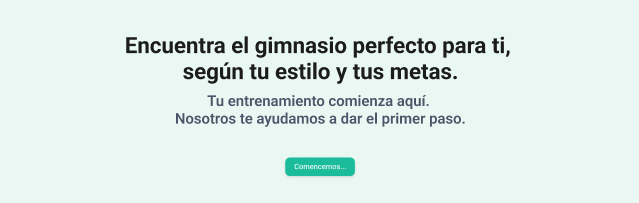
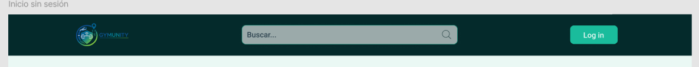
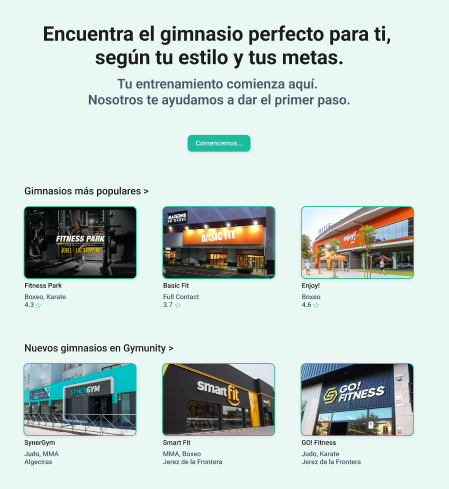
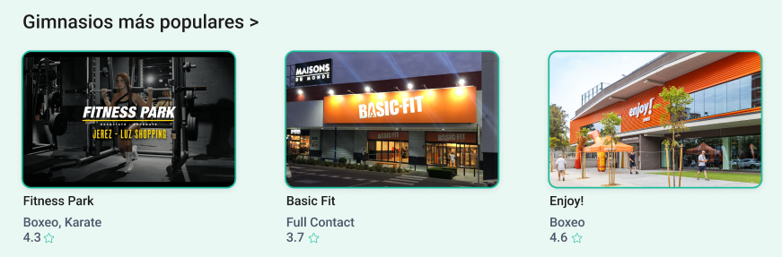
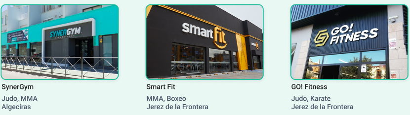

# Documentación de Diseño - Gymunity

## Índice

### 1. Fundamentos de diseño
- [1.1 Principios de comunicación visual](#11-principios-de-comunicación-visual)
  - Jerarquía
  - Contraste
  - Alineación
  - Proximidad
  - Repetición
- [1.2 Metodología CSS](#12-metodología-css)
- [1.3 Organización de archivos](#13-organización-de-archivos)
- [1.4 Sistema de Design Tokens](#14-sistema-de-design-tokens)
  - Paleta de colores
  - Tipografía
  - Espaciado
  - Breakpoints
  - Sombras
  - Z-index
  - Bordes y radios
- [1.5 Mixins y funciones](#15-mixins-y-funciones)
  - respond-down
  - flex-center
  - box-shadow
- [1.6 ViewEncapsulation en Angular](#16-viewencapsulation-en-angular)
  - Modos de encapsulación
  - Uso del selector :host
  - Buenas prácticas

### 2. HTML semántico y estructura
- [2.1 Elementos semánticos utilizados](#21-elementos-semánticos-utilizados)
- [2.2 Jerarquía de headings](#22-jerarquía-de-headings)
- [2.3 Estructura de formularios](#23-estructura-de-formularios)

### 3. Sistema de componentes UI
- [3.1 Componentes implementados](#31-componentes-implementados)
  - Botón
  - Alerta
  - Notificación / Toast
  - Card
  - Card Image
  - Campo de formulario
  - Área de texto
  - Selector
  - Buscador
  - Botón tema
  - Ventana emergente
  - Icono
  - Sección bienvenida
  - Spinner
  - Carga global
  - Acordeón
  - Tabs
  - Breadcrumbs
  - Menu usuario
  - Formulario login
  - Formulario registro
  - Formulario perfil
  - Tooltip
  - Tarjeta profesor
- [3.2 Nomenclatura y metodología BEM](#32-nomenclatura-y-metodología-bem)
- [3.3 Style Guide](#33-style-guide)
  - Botones
  - Alertas
  - Cards
  - Formularios
  - Buscador
  - Colores

### 4. Sistema Responsive
- [4.1 Breakpoints definidos](#41-breakpoints-definidos)
- [4.2 Estrategia responsive](#42-estrategia-responsive)
- [4.3 Container Queries](#43-container-queries)
- [4.4 Adaptaciones principales](#44-adaptaciones-principales)
- [4.5 Páginas implementadas](#45-páginas-implementadas)

---

## 1.1 Principios de comunicación visual

Los cinco principios básicos de comunicación visual ayudan a crear interfaces claras y efectivas:

**Jerarquía:** Consiste en organizar los elementos visuales según su importancia. Se logra usando diferentes tamaños, pesos de fuente y espaciado, guiando la atención del usuario hacia lo más relevante primero.



**Contraste:** Permite diferenciar elementos y destacar información clave. Se utiliza el color, el tamaño y el peso visual para que ciertos componentes resalten y sean fácilmente identificables.



**Alineación:** Es la disposición ordenada de los elementos en la interfaz. Una buena alineación, ya sea a la izquierda, centrada o en cuadrícula, aporta estructura y facilita la lectura.



**Proximidad:** Agrupa elementos relacionados mediante el uso del espacio. Cuando los objetos están cerca entre sí, el usuario los percibe como parte de un mismo grupo, lo que mejora la comprensión.



**Repetición:** Consiste en reutilizar patrones visuales, colores y estilos a lo largo del diseño. Esto genera coherencia y refuerza la identidad visual del proyecto.



## 1.2 Metodología CSS

Para este proyecto se utiliza la metodología BEM (Bloque, Elemento, Modificador) en la nomenclatura de clases CSS. BEM ayuda a mantener el código organizado, claro y fácil de escalar, evitando confusiones y estilos globales.

- **Bloques:** Representan componentes principales, por ejemplo: `.gym-grid`
- **Elementos:** Partes internas del bloque, por ejemplo: `.gym-grid__item`
- **Modificadores:** Variantes o estados, por ejemplo: `.gym-grid--section`

**Ejemplo:**
```scss
.gym-grid {
  /* estilos del bloque */
}
.gym-grid__item {
  /* estilos del elemento */
}
.gym-grid--section {
  /* estilos del modificador */
}
```

Esta metodología facilita la lectura y el mantenimiento del CSS en proyectos grandes o colaborativos.

## 1.3 Organización de archivos

El orden de las carpetas va de estilos más generales a más específicos. Así, las variables y herramientas se cargan primero, seguidos por resets, estilos base, layouts, componentes y utilidades. Esto evita conflictos y hace que el código sea más fácil de mantener y entender.

**Árbol de carpetas:**
```
styles/
├── 00-settings/
│   └── _variables.scss
├── 01-tools/
│   └── _mixins.scss
├── 02-generic/
│   └── _reset.scss
├── 03-elements/
│   └── _elements.scss
├── 04-layout/
│   └── _layout.scss
├── 05-components/
├── 06-utilities/
└── main.scss
```

## 1.4 Sistema de Design Tokens

Los Design Tokens son variables que definen los valores fundamentales del sistema de diseño. Permiten mantener la coherencia visual y facilitan cambios globales desde un único lugar.

### Paleta de colores

**Colores principales de marca:**
```scss
$color-header: #042A2B;        // Header y fondos oscuros
$color-hover-header: #063B3D;  // Hover del header
$color-fondo: #EAF8F4;         // Fondo principal de la app
```

**Colores de acción (botones):**
```scss
$color-botones: #34C6A0;        // Color principal de botones
$color-botones-hover: #2AAE8E;  // Hover
$color-botones-active: #0C5649; // Estado activo
```

**Escala de grises:**
```scss
$gris-50:  #F9FAFB;  // Fondos muy claros
$gris-100: #F3F4F6;  // Fondos claros
$gris-200: #E5E7EB;  // Bordes suaves
$gris-300: #D1D5DB;  // Bordes
$gris-400: #9CA3AF;  // Texto deshabilitado
$gris-500: #6B7280;  // Texto secundario
$gris-600: #4B5563;  // Texto claro
$gris-700: #374151;  // Texto medio
$gris-800: #1F2937;  // Texto oscuro
$gris-900: #111827;  // Texto muy oscuro
```

**Colores semánticos:**
```scss
$color-exito:   #2ECC71;  // Éxito, confirmación
$color-error:   #E74C3C;  // Error, peligro
$color-warning: #FFA726;  // Advertencia
$color-info:    #1976D2;  // Información
```

**Modo oscuro:**
```scss
// Fondos oscuros
$oscuro-fondo: #0F1C1C;
$oscuro-fondo-secundario: #1A2D2D;
$oscuro-header: #081414;

// Textos en modo oscuro
$oscuro-texto: #F0FAF7;
$oscuro-subtitulo: #8EC5B5;

// Acentos vibrantes para contraste
$oscuro-boton: #00E5A0;
$oscuro-boton-hover: #00CC8E;

// Semánticos ajustados para fondos oscuros
$oscuro-exito: #00E676;
$oscuro-error: #FF6B6B;
$oscuro-warning: #FFB74D;
$oscuro-info: #40C4FF;
```

### Tipografía

**Familia tipográfica:**
```scss
$fuente-principal: 'Roboto', Arial, sans-serif;
```

**Escala tipográfica:**
```scss
$texto-xs:  0.75rem;   // 12px - textos muy pequeños
$texto-sm:  0.875rem;  // 14px - textos secundarios
$texto-s:   1rem;      // 16px - texto base
$texto-md:  1rem;      // 16px - texto base (alias)
$texto-lg:  1.25rem;   // 20px - texto destacado
$texto-m:   1.5rem;    // 24px - subtítulos
$texto-l:   2rem;      // 32px - títulos sección
$texto-xl:  2.5rem;    // 40px - títulos grandes
$texto-2xl: 3rem;      // 48px - headings principales
```

**Pesos tipográficos:**
```scss
$font-weight-light: 300;
$font-weight-regular: 400;
$font-weight-medium: 500;
$font-weight-semibold: 600;
$font-weight-bold: 700;
```

**Alturas de línea:**
```scss
$line-height-tight: 1.1;    // Títulos compactos
$line-height-normal: 1.5;   // Texto general
$line-height-relaxed: 1.75; // Texto largo
```

### Espaciado

Sistema de espaciado basado en múltiplos de 8px (0.5rem):

```scss
$space-1:  0.5rem;   // 8px
$space-2:  1rem;     // 16px
$space-3:  1.5rem;   // 24px
$space-4:  2rem;     // 32px
$space-5:  2.5rem;   // 40px
$space-6:  3rem;     // 48px
$space-8:  4rem;     // 64px
$space-10: 5rem;     // 80px
$space-12: 6rem;     // 96px
```

### Breakpoints

Media queries desktop-first:

```scss
$breakpoint-sm: 640px;   // Móviles grandes
$breakpoint-md: 768px;   // Tablets
$breakpoint-lg: 1024px;  // Desktop
$breakpoint-xl: 1280px;  // Desktop grande
```

### Sombras

```scss
// Sombras generales
$shadow-sm: 0 1px 4px 0 rgba(0, 0, 0, 0.08);   // Sutil
$shadow-md: 0 2px 8px 0 rgba(0, 0, 0, 0.16);   // Media
$shadow-lg: 0 4px 16px 0 rgba(0, 0, 0, 0.24);  // Pronunciada

// Sombras de botones (con color de marca)
$shadow-boton: 0 4px 12px 0 rgba(52, 198, 160, 0.4);
$shadow-boton-hover: 0 6px 16px 0 rgba(42, 174, 142, 0.5);

// Sombras modo oscuro (glow verde)
$oscuro-shadow-boton: 0 4px 20px 0 rgba(0, 229, 160, 0.35);
```

### Z-index

Sistema de capas ordenado:

```scss
$z-base: 1;       // Nivel base
$z-dropdown: 2;   // Menús desplegables
$z-sticky: 3;     // Elementos sticky
$z-overlay: 4;    // Overlays
$z-modal: 5;      // Modales (máxima prioridad)
```

### Bordes y radios

```scss
// Grosores de borde
$borde-thin: 1px;
$borde-medium: 2px;
$borde-thick: 4px;

// Radios de esquina
$radio-sm: 2px;     // Muy sutil
$radio-md: 4px;     // Botones, inputs
$radio-lg: 8px;     // Cards, contenedores
$radio-xl: 16px;    // Modales
$radio-full: 9999px; // Círculos, pills
```

---

## 1.5 Mixins y funciones

Los mixins permiten reutilizar bloques de CSS de manera eficiente. Están definidos en `01-tools/_mixins.scss`.

### Mixins disponibles

#### **respond-down** - Media query desktop-first

Aplica estilos hasta un breakpoint determinado. Usa la estrategia desktop-first (max-width).

```scss
// Uso
.elemento {
  padding: $space-6; // Desktop por defecto

  @include respond-down(lg) {
    padding: $space-4; // Tablet y menor
  }

  @include respond-down(sm) {
    padding: $space-2; // Móvil
  }
}
```

**Breakpoints disponibles:**
- `xl`: hasta 1279px
- `lg`: hasta 1023px
- `md`: hasta 767px
- `sm`: hasta 639px

---

#### **flex-center** - Centrar con flexbox

Centra un elemento tanto horizontal como verticalmente usando flexbox.

```scss
// Definición
@mixin flex-center {
  display: flex;
  align-items: center;
  justify-content: center;
}

// Uso
.contenedor-centrado {
  @include flex-center;
  height: 100vh;
}
```

---

#### **box-shadow** - Aplicar sombra

Aplica una sombra predefinida o personalizada.

```scss
// Definición
@mixin box-shadow($shadow: $shadow-md) {
  box-shadow: $shadow;
}

// Uso con valor por defecto
.card {
  @include box-shadow; // Usa $shadow-md
}

// Uso con sombra personalizada
.boton {
  @include box-shadow($shadow-boton);
}
```

**Sombras disponibles en variables:**
- `$shadow-sm`: Sombra sutil
- `$shadow-md`: Sombra media (por defecto)
- `$shadow-lg`: Sombra pronunciada
- `$shadow-boton`: Sombra verde para botones primarios

---

## 1.6 ViewEncapsulation en Angular

Angular por defecto aplica **View Encapsulation** a los componentes, lo que afecta cómo se aplican los estilos CSS.

### Modos de encapsulación

1. **Emulated (por defecto):** Angular simula Shadow DOM añadiendo atributos únicos a los elementos
2. **ShadowDom:** Usa Shadow DOM nativo del navegador
3. **None:** Sin encapsulación, estilos globales

### Uso del selector :host

Cuando un componente tiene una clase aplicada al elemento host (mediante `@HostBinding` o `[class]`), se debe usar `:host` para estilizar:

```scss
// ❌ INCORRECTO - No funciona con ViewEncapsulation
.acordeon-item--expandido .acordeon__contenido {
  grid-template-rows: 1fr;
}

// ✅ CORRECTO - Funciona con ViewEncapsulation
:host.acordeon-item--expandido .acordeon__contenido {
  grid-template-rows: 1fr;
}
```

### Ejemplo práctico: Componente Acordeón

**TypeScript:**
```typescript
@Component({
  selector: 'app-acordeon-item',
  templateUrl: './acordeon-item.html',
  styleUrls: ['./acordeon-item.scss']
})
export class AcordeonItemComponent {
  expandido = signal(false);

  @HostBinding('class.acordeon-item--expandido')
  get claseExpandido() {
    return this.expandido();
  }
}
```

**SCSS:**
```scss
// El host es el elemento <app-acordeon-item>
:host {
  display: block;
}

// Cuando el host tiene la clase --expandido
:host.acordeon-item--expandido {
  .acordeon__icono {
    transform: rotate(180deg);
  }
  
  .acordeon__contenido {
    grid-template-rows: 1fr;
  }
}
```

### Buenas prácticas

1. **Usar `:host` para clases del elemento raíz**
2. **Evitar `::ng-deep`** - está deprecado
3. **Usar variables CSS** para valores dinámicos desde el padre
4. **Preferir composición** sobre herencia de estilos

---

## 2. HTML semántico y estructura

### 2.1 Elementos semánticos utilizados

Se utilizan elementos HTML5 semánticos para mejorar la accesibilidad y el SEO:

| Elemento | Uso | Ejemplo en el proyecto |
|----------|-----|------------------------|
| `<header>` | Cabecera principal con logo, buscador y navegación | Layout header |
| `<nav>` | Navegación y enlaces de redes sociales | Header y footer |
| `<main>` | Contenido principal de la página | Layout main |
| `<section>` | Agrupación de contenido relacionado | Contenedores internos |
| `<article>` | Contenido independiente (marca, contacto) | Footer brand/contacto |
| `<footer>` | Pie de página con información de contacto | Layout footer |
| `<search>` | Área de búsqueda (HTML5.2) | Buscador en header |

**Ejemplo de header:**
```html
<header class="gym-header">
  <section class="gym-header__container">
    <a class="gym-header__logo" routerLink="/">
      
    </a>
    <search class="gym-header__buscador">
      <app-buscador placeholder="Buscar..."></app-buscador>
    </search>
    <nav class="gym-header__utils">
      <app-boton-tema></app-boton-tema>
      <app-boton>Iniciar Sesión</app-boton>
    </nav>
  </section>
</header>
```

**Ejemplo de main:**
```html
<main class="gym-main">
  <ng-content></ng-content>
</main>
```

**Ejemplo de footer:**
```html
<footer class="gym-footer">
  <section class="gym-footer__container">
    <article class="gym-footer__brand">
      
      <p class="gym-footer__slogan">Conecta con los mejores gimnasios...</p>
    </article>
    <article class="gym-footer__contacto">
      <nav class="gym-footer__social" aria-label="Redes sociales">
        <!-- Enlaces de las redes sociales -->
      </nav>
    </article>
  </section>
  <p class="gym-footer__copyright">© 2025 Gymunity</p>
</footer>
```

### 2.2 Jerarquía de headings

**Reglas aplicadas:**
- Solo un `<h1>` por página (título principal)
- `<h2>` para secciones principales
- `<h3>` para subsecciones o tarjetas
- NUNCA se saltan niveles

**Diagrama de jerarquía:**
```
Página de Inicio
├── h1: "Encuentra el gimnasio perfecto para ti"
│   ├── h2: "Gimnasios más populares"
│   │   └── h3: [Nombre del gimnasio] (en cada tarjeta)
│   └── h2: "Nuevos gimnasios en Gymunity"
│       └── h3: [Nombre del gimnasio] (en cada tarjeta)

Página de Búsqueda
├── h1: "Estos son los gimnasios que hemos encontrado"
│   └── h3: [Nombre del gimnasio] (en cada resultado)

Tarjeta de Gimnasio (detalle)
├── h1: [Nombre del gimnasio]
│   ├── h2: "Profesores y artes impartidas"
│   ├── h2: "Torneos disponibles"
│   └── h2: "Reseñas de otros alumnos"
```

### 2.3 Estructura de formularios

Los formularios siguen las mejores prácticas de accesibilidad:

- **`<fieldset>`**: Agrupa campos relacionados
- **`<legend>`**: Describe el propósito del grupo
- **`<label>`**: Asociado al input mediante `for` e `id`
- **Atributos ARIA**: `aria-describedby`, `aria-invalid` para accesibilidad

**Ejemplo del componente campo-formulario:**
```html
<label class="campo-formulario__label" [for]="inputId">
  {{ label }}
  @if (required) {
    <abbr class="campo-formulario__required" title="Campo obligatorio">*</abbr>
  }
</label>

<input 
  class="campo-formulario__field"
  [type]="type"
  [id]="inputId"
  [name]="name"
  [required]="required"
  [attr.aria-describedby]="helpText ? inputId + '-help' : null"
  [attr.aria-invalid]="hasError"
/>

@if (hasError && errorMessage) {
  <small class="campo-formulario__error" [id]="inputId + '-error'" role="alert">
    {{ errorMessage }}
  </small>
}
```

**Ejemplo de formulario completo (registro):**
```html
<form class="formulario-auth">
  <fieldset class="formulario-auth__fieldset">
    <legend class="formulario-auth__legend">Crear cuenta</legend>
    
    <app-campo-formulario
      label="Usuario o email:"
      type="email"
      inputId="registro-email"
      name="email"
      [required]="true">
    </app-campo-formulario>
    
    <app-campo-formulario
      label="Contraseña:"
      type="password"
      inputId="registro-password"
      name="password"
      [required]="true">
    </app-campo-formulario>
    
    <app-boton tipo="submit">Registrarse</app-boton>
  </fieldset>
</form>
```

La asociación `for`/`id` garantiza que al hacer clic en el label se enfoque el input correspondiente, mejorando la usabilidad y accesibilidad.

---

## 3. Sistema de componentes UI

### 3.1 Componentes implementados

#### **Botón** (`app-boton`)

**Nombre del componente:** Botón

**Propósito:** Ejecutar acciones interactivas como enviar formularios, abrir modales o navegar.

**Variantes disponibles:**
- `primary`: Acción principal (fondo verde brillante)
- `secondary`: Acción secundaria (fondo gris neutro)
- `ghost`: Acción terciaria (transparente con borde)
- `danger`: Acción destructiva (fondo rojo)

**Tamaños disponibles:**
- `sm`: Pequeño
- `md`: Mediano (por defecto)
- `lg`: Grande

**Estados que maneja:**
- Normal
- Hover
- Active
- Focus
- Disabled

**Ejemplo de uso:**
```html
<app-boton variante="primary" tamanio="md" tipo="submit">
  Registrarse
</app-boton>

<app-boton variante="ghost" tamanio="sm" [disabled]="true">
  Cancelar
</app-boton>
```

---

#### **Alerta** (`app-alerta`)

**Nombre del componente:** Alerta

**Propósito:** Mostrar mensajes de feedback inline al usuario sobre el resultado de una acción.

**Variantes disponibles:**
- `success`: Operación exitosa
- `error`: Error o problema
- `warning`: Advertencia
- `info`: Información general

**Tamaños disponibles:** Tamaño único (se adapta al contenido)

**Estados que maneja:**
- Visible
- Cerrable (con botón X)

**Ejemplo de uso:**
```html
<app-alerta 
  tipo="success" 
  mensaje="Registro completado correctamente" 
  [cerrable]="true">
</app-alerta>

<app-alerta 
  tipo="error" 
  mensaje="Email no válido">
</app-alerta>
```

---

#### **Notificación** (`app-notificacion`)

**Nombre del componente:** Notificación

**Propósito:** Mostrar mensajes toast temporales en la esquina de la pantalla.

**Variantes disponibles:**
- `success`: Confirmación exitosa
- `error`: Error o problema
- `warning`: Advertencia
- `info`: Información

**Tamaños disponibles:** Tamaño único fijo

**Estados que maneja:**
- Visible con temporizador automático (5s por defecto)
- Cerrable manualmente

**Ejemplo de uso:**
```html
<app-notificacion 
  tipo="success" 
  mensaje="Cambios guardados" 
  [duracion]="3000"
  [visible]="mostrarNotif"
  (cerrar)="mostrarNotif = false">
</app-notificacion>
```

---

#### **Card** (`app-card`)

**Nombre del componente:** Card (Tarjeta de gimnasio)

**Propósito:** Mostrar información de gimnasios con imagen, título, subtítulo, rating y botón de acción.

**Variantes disponibles:**
- `vertical`: Tarjeta vertical con imagen arriba
- `horizontal`: Tarjeta horizontal con imagen a la izquierda

**Tamaños disponibles:**
- Vertical: Ancho fluido (se adapta al contenedor)
- Horizontal: Max-width 56rem

**Estados que maneja:**
- Normal
- Hover (elevación, borde verde, zoom en imagen)

**Ejemplo de uso:**
```html
<app-card
  variant="vertical"
  title="Fitness Park"
  subtitle="Boxeo, Karate"
  rating="4.3 ⭐"
  imageSrc="assets/gimnasio1.jpg"
  imageAlt="Gimnasio Fitness Park">
</app-card>

<app-card
  variant="horizontal"
  title="Smart Fit"
  subtitle="MMA, Boxeo"
  rating="3.9 ⭐"
  imageSrc="assets/smart-fit.jpg"
  imageAlt="Smart Fit">
</app-card>
```

---

#### **Campo de formulario** (`app-campo-formulario`)

**Nombre del componente:** Campo de formulario

**Propósito:** Input de texto con label, validación y mensajes de ayuda/error.

**Variantes disponibles:** No tiene variantes visuales

**Tamaños disponibles:** Tamaño único (ancho fluido)

**Estados que maneja:**
- Normal
- Hover
- Focus
- Error
- Disabled

**Ejemplo de uso:**
```html
<app-campo-formulario
  label="Correo electrónico"
  type="email"
  inputId="email"
  name="email"
  [required]="true"
  helpText="Usa tu email personal"
  errorMessage="Email no válido">
</app-campo-formulario>
```

---

#### **Área de texto** (`app-area-texto`)

**Nombre del componente:** Área de texto

**Propósito:** Input multilínea para textos largos como comentarios o descripciones.

**Variantes disponibles:** No tiene variantes visuales

**Tamaños disponibles:** Altura configurable por número de filas

**Estados que maneja:**
- Normal
- Hover
- Focus
- Error
- Disabled

**Ejemplo de uso:**
```html
<app-area-texto
  label="Comentario"
  inputId="comentario"
  name="comentario"
  [filas]="4"
  [required]="true">
</app-area-texto>
```

---

#### **Selector** (`app-selector`)

**Nombre del componente:** Selector

**Propósito:** Dropdown para elegir una opción de una lista predefinida.

**Variantes disponibles:** No tiene variantes visuales

**Tamaños disponibles:** Tamaño único (ancho fluido)

**Estados que maneja:**
- Normal
- Hover
- Focus
- Error
- Disabled

**Ejemplo de uso:**
```html
<app-selector
  label="Arte marcial"
  inputId="arte"
  name="arte"
  [opciones]="['Karate', 'Judo', 'Boxeo', 'MMA']"
  [required]="true">
</app-selector>
```

---

#### **Buscador** (`app-buscador`)

**Nombre del componente:** Buscador

**Propósito:** Input de búsqueda con icono, expandible en mobile.

**Variantes disponibles:** No tiene variantes visuales

**Tamaños disponibles:** Responsivo (compacto en mobile, expandido en desktop)

**Estados que maneja:**
- Normal
- Hover
- Focus
- Expandido (mobile)

**Ejemplo de uso:**
```html
<app-buscador 
  placeholder="Buscar gimnasios..." 
  (buscar)="onBuscar($event)">
</app-buscador>
```

---

#### **Botón tema** (`app-boton-tema`)

**Nombre del componente:** Botón tema

**Propósito:** Toggle para cambiar entre modo claro y oscuro.

**Variantes disponibles:** No tiene variantes visuales

**Tamaños disponibles:** Tamaño único

**Estados que maneja:**
- Normal
- Hover
- Active (cambia icono sun/moon según tema activo)

**Ejemplo de uso:**
```html
<app-boton-tema aria-label="Cambiar tema"></app-boton-tema>
```

---

#### **Ventana emergente** (`app-ventana-emergente`)

**Nombre del componente:** Ventana emergente (Modal)

**Propósito:** Modal centrado con overlay oscuro para mostrar formularios o contenido importante.

**Variantes disponibles:** No tiene variantes visuales

**Tamaños disponibles:** Tamaño único con ancho máximo

**Estados que maneja:**
- Abierto (con animación fadeIn y slideUp)
- Cerrado

**Ejemplo de uso:**
```html
<app-ventana-emergente 
  [abierto]="modalAbierto" 
  (cerrar)="modalAbierto = false">
  <app-formulario-login></app-formulario-login>
</app-ventana-emergente>
```

---

#### **Icono** (`app-icono`)

**Nombre del componente:** Icono

**Propósito:** Wrapper para iconos Lucide con tamaño y color consistentes.

**Variantes disponibles:** No tiene variantes visuales

**Tamaños disponibles:** Tamaño único (1.25rem × 1.25rem)

**Estados que maneja:**
- Normal

**Ejemplo de uso:**
```html
<app-icono nombre="search"></app-icono>
<app-icono nombre="user"></app-icono>
<app-icono nombre="menu"></app-icono>
```

---

#### **Sección bienvenida** (`app-seccion-bienvenida`)

**Nombre del componente:** Sección bienvenida

**Propósito:** Hero section con título, subtítulo y CTA principal para la página de inicio.

**Variantes disponibles:** No tiene variantes visuales

**Tamaños disponibles:** Tamaño único responsivo

**Estados que maneja:**
- Normal

**Ejemplo de uso:**
```html
<app-seccion-bienvenida
  titulo="Encuentra el gimnasio perfecto"
  subtitulo="según tu estilo y tus metas"
  textoCta="Únete gratis"
  (clickCta)="abrirRegistro()">
</app-seccion-bienvenida>
```

---

#### **Spinner** (`app-spinner`)

**Nombre del componente:** Spinner

**Propósito:** Indicador de carga circular animado para operaciones asíncronas.

**Variantes disponibles:** No tiene variantes visuales

**Tamaños disponibles:**
- `sm`: Pequeño (24px)
- `md`: Mediano (40px, por defecto)
- `lg`: Grande (64px)

**Estados que maneja:**
- Normal (animación continua)
- Con porcentaje (muestra progreso)
- Con overlay (fondo oscuro)

**Ejemplo de uso:**
```html
<app-spinner tamano="md" texto="Cargando datos..."></app-spinner>

<app-spinner 
  tamano="lg" 
  [porcentaje]="75" 
  [overlay]="true">
</app-spinner>
```

---

#### **Carga global** (`app-carga-global`)

**Nombre del componente:** Carga global

**Propósito:** Overlay de pantalla completa para operaciones de carga que bloquean la UI.

**Variantes disponibles:** No tiene variantes visuales

**Tamaños disponibles:** Tamaño único (pantalla completa)

**Estados que maneja:**
- Visible (cargando)
- Oculto (no cargando)
- Con mensaje personalizado
- Con porcentaje de progreso

**Ejemplo de uso:**
```html
<app-carga-global></app-carga-global>
```

---

#### **Acordeón** (`app-acordeon-item`)

**Nombre del componente:** Acordeón

**Propósito:** Panel colapsable para mostrar/ocultar contenido, ideal para FAQs o secciones extensas.

**Variantes disponibles:** No tiene variantes visuales

**Tamaños disponibles:** Tamaño único (ancho fluido)

**Estados que maneja:**
- Colapsado (cerrado)
- Expandido (abierto)
- Hover en cabecera
- Focus (navegación por teclado)

**Ejemplo de uso:**
```html
<app-acordeon-item 
  titulo="¿Cómo me registro?" 
  icono="help-circle"
  [abierto]="false">
  <p>Para registrarte, haz clic en el botón "Registrarse"...</p>
</app-acordeon-item>
```

---

#### **Tabs** (`app-tabs`)

**Nombre del componente:** Tabs

**Propósito:** Navegación entre paneles de contenido mediante pestañas.

**Variantes disponibles:** No tiene variantes visuales

**Tamaños disponibles:** Tamaño único (ancho fluido)

**Estados que maneja:**
- Tab activo
- Tab inactivo
- Hover
- Focus
- Navegación por teclado (flechas, Home, End)

**Ejemplo de uso:**
```html
<app-tabs 
  [pestanas]="['Información', 'Horarios', 'Precios']"
  (tabCambiado)="onTabChange($event)">
</app-tabs>
```

---

#### **Breadcrumbs** (`app-breadcrumbs`)

**Nombre del componente:** Breadcrumbs

**Propósito:** Navegación jerárquica que muestra la ubicación actual del usuario en la aplicación.

**Variantes disponibles:** No tiene variantes visuales

**Tamaños disponibles:** Tamaño único

**Estados que maneja:**
- Visible (más de un nivel)
- Oculto (página raíz)
- Links clicables (niveles anteriores)
- Texto sin link (nivel actual)

**Ejemplo de uso:**
```html
<app-breadcrumbs></app-breadcrumbs>
<!-- Renderiza automáticamente: Inicio > Gimnasios > Smart Fit -->
```

---

#### **Menu usuario** (`app-menu-usuario`)

**Nombre del componente:** Menú usuario

**Propósito:** Dropdown con avatar del usuario y opciones de perfil/configuración/logout.

**Variantes disponibles:** No tiene variantes visuales

**Tamaños disponibles:** Tamaño único

**Estados que maneja:**
- Cerrado
- Abierto (dropdown visible)
- Cierre al hacer clic fuera
- Cierre con tecla Escape

**Ejemplo de uso:**
```html
<app-menu-usuario></app-menu-usuario>
```

---

#### **Toast** (`app-toast`)

**Nombre del componente:** Toast

**Propósito:** Notificaciones temporales no intrusivas en esquina de pantalla.

**Variantes disponibles:**
- `success`: Confirmación exitosa (verde)
- `error`: Error (rojo)
- `warning`: Advertencia (naranja)
- `info`: Información (azul)

**Tamaños disponibles:** Tamaño único fijo

**Estados que maneja:**
- Visible con temporizador automático
- Animación de entrada/salida
- Cerrable manualmente
- Pausable al hacer hover

**Ejemplo de uso:**
```html
<app-toast></app-toast>
<!-- Se controla mediante NotificacionService -->
```

---

#### **Card Image** (`app-card-image`)

**Nombre del componente:** Card Image

**Propósito:** Componente de imagen optimizado para cards con fallback y lazy loading.

**Variantes disponibles:**
- `vertical`: Para cards verticales
- `horizontal`: Para cards horizontales

**Tamaños disponibles:**
- `sm`: Pequeño
- `md`: Mediano (por defecto)
- `lg`: Grande

**Estados que maneja:**
- Cargando
- Cargada
- Error (muestra placeholder)

**Ejemplo de uso:**
```html
<app-card-image 
  src="assets/gimnasio.jpg" 
  alt="Gimnasio Smart Fit"
  size="md"
  variant="vertical">
</app-card-image>
```

---

#### **Formulario login** (`app-formulario-login`)

**Nombre del componente:** Formulario login

**Propósito:** Formulario de inicio de sesión con validación.

**Variantes disponibles:** No tiene variantes visuales

**Tamaños disponibles:** Tamaño único

**Estados que maneja:**
- Normal
- Validando
- Cargando (enviando)
- Error de servidor
- Campos con error de validación

**Ejemplo de uso:**
```html
<app-formulario-login 
  (enviar)="onLogin($event)"
  (irRegistro)="mostrarRegistro()"
  (cerrar)="cerrarModal()">
</app-formulario-login>
```

---

#### **Formulario registro** (`app-formulario-registro`)

**Nombre del componente:** Formulario registro

**Propósito:** Formulario de creación de cuenta con validación completa.

**Variantes disponibles:** No tiene variantes visuales

**Tamaños disponibles:** Tamaño único

**Estados que maneja:**
- Normal
- Validación en tiempo real
- Validación asíncrona (username/email disponible)
- Indicador de fuerza de contraseña
- Cargando
- Error de servidor

**Ejemplo de uso:**
```html
<app-formulario-registro 
  (enviar)="onRegistro($event)"
  (irLogin)="mostrarLogin()"
  (cerrar)="cerrarModal()">
</app-formulario-registro>
```

---

#### **Formulario perfil** (`app-formulario-perfil`)

**Nombre del componente:** Formulario perfil

**Propósito:** Formulario de edición de datos del usuario con campos dinámicos.

**Variantes disponibles:** No tiene variantes visuales

**Tamaños disponibles:** Tamaño único

**Estados que maneja:**
- Normal
- Editando
- Validación de campos
- Campos de redes sociales dinámicos (añadir/eliminar)
- Guardando cambios

**Ejemplo de uso:**
```html
<app-formulario-perfil 
  [datosIniciales]="usuario"
  (enviar)="onGuardarPerfil($event)"
  (cancelar)="onCancelar()">
</app-formulario-perfil>
```

---

#### **Tooltip** (`app-tooltip`)

**Nombre del componente:** Tooltip

**Propósito:** Información contextual flotante que aparece al hacer hover sobre un elemento.

**Variantes disponibles:** No tiene variantes visuales

**Posiciones disponibles:**
- `arriba`: Encima del elemento (por defecto)
- `abajo`: Debajo del elemento
- `izquierda`: A la izquierda
- `derecha`: A la derecha

**Estados que maneja:**
- Oculto
- Visible (con animación fadeIn)
- Reposicionamiento automático si sale del viewport

**Ejemplo de uso:**
```html
<app-tooltip texto="Más información" posicion="arriba">
  <button>Ayuda</button>
</app-tooltip>
```

---

#### **Tarjeta profesor** (`app-tarjeta-profesor`)

**Nombre del componente:** Tarjeta profesor

**Propósito:** Mostrar información de un profesor con imagen, nombre y enlace a su perfil.

**Variantes disponibles:** No tiene variantes visuales (se adapta mediante Container Queries)

**Tamaños disponibles:** Fluido, se adapta al contenedor padre

**Estados que maneja:**
- Normal
- Hover (elevación sutil)
- Adaptación automática (< 300px contenedor)

**Ejemplo de uso:**
```html
<app-tarjeta-profesor
  [profesor]="profesor"
  (click)="verPerfil(profesor.id)">
</app-tarjeta-profesor>
```

**Adaptaciones responsive:**
- Usa Container Queries para adaptar layout según ancho del contenedor
- En contenedores estrechos (< 300px): oculta avatar, ajusta tipografía
- Documentado en sección 4.3 Container Queries

---

### 3.2 Nomenclatura y metodología BEM

**BEM (Bloque-Elemento-Modificador)** es la metodología CSS utilizada en este proyecto para estructurar las clases de forma escalable y mantenible.

#### **Estrategia de nomenclatura:**

**Block (Bloque):** Componente independiente y reutilizable. Representa la entidad raíz.
- Sintaxis: `.nombre-componente`
- Ejemplo: `.boton`, `.card`, `.alerta`, `.gym-header`

**Element (Elemento):** Parte interna del bloque que no tiene sentido fuera de él.
- Sintaxis: `.bloque__elemento`
- Ejemplo: `.card__title`, `.gym-header__logo`, `.campo-formulario__label`

**Modifier (Modificador):** Variación o estado del bloque o elemento.
- Sintaxis: `.bloque--modificador` o `.bloque__elemento--modificador`
- Ejemplo: `.boton--primary`, `.card--horizontal`, `.campo-formulario__field--error`

#### **Cuándo usar modificadores vs clases de estado:**

**Modificadores (--) se usan para:**
- Variantes visuales permanentes: `.boton--primary`, `.boton--ghost`, `.alerta--success`
- Tamaños: `.boton--sm`, `.boton--lg`
- Tipos de layout: `.card--horizontal`, `.card--vertical`

**Clases de estado o atributos se usan para:**
- Estados dinámicos que cambian con JavaScript: `[disabled]`, `[aria-hidden]`
- Pseudo-clases CSS: `:hover`, `:focus`, `:active`
- Estados temporales: `.is-open`, `.is-active` (cuando no se puede usar atributos)

#### **Ejemplos reales del proyecto:**

**Header:**
```scss
.gym-header { 
  /* Bloque: Componente raíz del header */
}

.gym-header__container { 
  /* Elemento: Contenedor interno del header */
}

.gym-header__logo { 
  /* Elemento: Logo dentro del header */
}

.gym-header__buscador { 
  /* Elemento: Zona de búsqueda */
}

.gym-header__nav { 
  /* Elemento: Navegación principal */
}

.gym-header__nav--abierto { 
  /* Modificador: Estado del menú desplegado en mobile */
}
```

**Card:**
```scss
.card { 
  /* Bloque: Componente tarjeta */
}

.card-body { 
  /* Elemento: Cuerpo de la tarjeta */
}

.card-title { 
  /* Elemento: Título de la tarjeta */
}

.card-subtitle { 
  /* Elemento: Subtítulo */
}

.card-rating { 
  /* Elemento: Rating con estrella */
}

.card.horizontal { 
  /* Modificador: Variante horizontal (clase adicional) */
}

.card.vertical { 
  /* Modificador: Variante vertical */
}
```

**Selector (dropdown):**
```scss
.selector { 
  /* Bloque: Componente select */
}

.selector__label { 
  /* Elemento: Etiqueta del campo */
}

.selector__field { 
  /* Elemento: Campo select nativo */
}

.selector__field--error { 
  /* Modificador: Estado de error en el campo */
}

.selector__icon { 
  /* Elemento: Icono dropdown */
}

.selector__field[disabled] { 
  /* Estado: Usando atributo HTML para disabled */
}
```

**Botón:**
```scss
.boton { 
  /* Bloque: Componente botón */
}

.boton--primary { 
  /* Modificador: Variante primaria */
}

.boton--secondary { 
  /* Modificador: Variante secundaria */
}

.boton--ghost { 
  /* Modificador: Variante ghost */
}

.boton--danger { 
  /* Modificador: Variante destructiva */
}

.boton--sm { 
  /* Modificador: Tamaño pequeño */
}

.boton--md { 
  /* Modificador: Tamaño mediano */
}

.boton--lg { 
  /* Modificador: Tamaño grande */
}

.boton:hover { 
  /* Pseudo-clase: Estado hover (no modificador) */
}

.boton[disabled] { 
  /* Atributo: Estado disabled (no modificador) */
}
```

**Campo de formulario:**
```scss
.campo-formulario { 
  /* Bloque: Componente campo de texto */
}

.campo-formulario__label { 
  /* Elemento: Label del input */
}

.campo-formulario__field { 
  /* Elemento: Input de texto */
}

.campo-formulario__error { 
  /* Elemento: Mensaje de error */
}

.campo-formulario__help { 
  /* Elemento: Texto de ayuda */
}

.campo-formulario__required { 
  /* Elemento: Indicador de campo obligatorio (*) */
}
```

#### **Ventajas de esta estrategia:**

1. **Especificidad baja:** No hay conflictos de cascada CSS
2. **Legibilidad:** La clase describe exactamente qué es y dónde está
3. **Escalabilidad:** Fácil añadir nuevos componentes sin afectar los existentes
4. **Mantenibilidad:** Buscar y modificar estilos es directo
5. **Sin colisiones:** Los nombres de clase son únicos por su estructura

---

### 3.3 Style Guide

La **Guía de Estilo** (`/guia-estilo`) es una página de documentación visual implementada en el proyecto que muestra todos los componentes del sistema de diseño funcionando en tiempo real.

#### **Propósito:**

1. **Documentación visual:** Ver todos los componentes y sus variantes en un solo lugar sin navegar por toda la aplicación.

2. **Testing manual:** Probar interacciones y estados (hover, disabled, error) de forma aislada para detectar bugs visuales.

3. **Referencia de desarrollo:** Los desarrolladores pueden copiar ejemplos de código directamente desde la implementación real en lugar de documentación desactualizada.

4. **Control de calidad:** Detectar inconsistencias visuales entre componentes, verificar que respetan las variables de diseño y el tema oscuro/claro.

5. **Onboarding:** Nuevos miembros del equipo pueden entender rápidamente qué componentes existen y cómo usarlos.

#### **Componentes documentados en el Style Guide**

**Botones**


Muestra todas las variantes (primario, secundario, ghost, danger), tamaños y estados de los botones usados en la web.

---

**Cards**


Tarjetas verticales y horizontales para gimnasios, con imagen, rating y acciones.

---

**Alertas y feedback**


Alertas de éxito, error, advertencia, info y notificaciones toast, con iconos y cierre.

---

**Formularios**


Inputs, selects, textarea y validaciones en todos los estados (normal, error, disabled, ayuda).

---

**Navegación**


Menú principal, menú usuario, breadcrumbs y tabs para la navegación de la app.

---

**Componentes interactivos**


Acordeón, tooltips, buscador expandible y otros elementos UI dinámicos.

---

**Iconos**


Set de iconos Lucide personalizados para acciones, menús y feedback visual.

---

**Colores**


Paleta de colores de marca, semánticos y modo oscuro/claro.

---

**Tipografía**


Jerarquía de títulos, textos y estilos tipográficos usados en la interfaz.

---

## 4. Sistema Responsive

### 4.1 Breakpoints definidos

| Nombre | Valor | Dispositivo | Justificación |
|--------|-------|-------------|---------------|
| `$breakpoint-sm` | 640px | Móvil | Abarca la mayoría de móviles actuales (320-639px) |
| `$breakpoint-md` | 768px | Tablet vertical | Punto donde las tablets necesitan un layout diferente |
| `$breakpoint-lg` | 1024px | Tablet horizontal / Portátil | Transición a layouts de varias columnas |
| `$breakpoint-xl` | 1280px | Escritorio | Monitores 1080p y pantallas grandes |

Estos valores están basados en los estándares más usados (Tailwind CSS, Bootstrap) y cubren prácticamente todos los dispositivos del mercado.

### 4.2 Estrategia responsive

**Enfoque: Desktop-First**

He elegido Desktop-First por varios motivos:
- Los usuarios de gimnasios suelen buscar y comparar opciones desde el ordenador
- Hay mucho contenido (galerías, reseñas, clases) que se ve mejor en pantallas grandes
- Es más fácil simplificar un diseño complejo para móvil que hacer lo contrario

**Implementación con el mixin `respond-down`:**

```scss
// styles/01-tools/_mixins.scss
@mixin respond-down($breakpoint) {
  @if $breakpoint == xl {
    @media (max-width: #{$breakpoint-xl - 1px}) { @content; }
  } @else if $breakpoint == lg {
    @media (max-width: #{$breakpoint-lg - 1px}) { @content; }
  } @else if $breakpoint == md {
    @media (max-width: #{$breakpoint-md - 1px}) { @content; }
  } @else if $breakpoint == sm {
    @media (max-width: #{$breakpoint-sm - 1px}) { @content; }
  }
}
```

**Ejemplo de uso:**

```scss
.gimnasios-grid {
  display: grid;
  grid-template-columns: repeat(3, 1fr);  // Escritorio: 3 columnas
  gap: $space-4;

  @include respond-down(lg) {
    grid-template-columns: repeat(2, 1fr);  // Tablet: 2 columnas
  }

  @include respond-down(sm) {
    grid-template-columns: 1fr;  // Móvil: 1 columna
    gap: $space-3;
  }
}
```

### 4.3 Container Queries

Con Container Queries los componentes se adaptan según el ancho de su contenedor en vez del viewport. Esto hace que sean reutilizables en cualquier contexto.

**Componentes con Container Queries:**

| Componente | Archivo | Motivo |
|------------|---------|--------|
| `Card` | `card/card.scss` | Se usa en grids de 1, 2 o 3 columnas dependiendo de la página |
| `TarjetaProfesor` | `tarjeta-profesor/tarjeta-profesor.scss` | Aparece en sidebars y grids con anchos distintos |

**Ejemplo en Card:**

```scss
// card.scss
.card {
  container-type: inline-size;
  container-name: card;
  
  // Estilos base...
}

// Si el contenedor tiene menos de 300px, cambia a layout vertical
@container card (max-width: 300px) {
  .card {
    flex-direction: column;
  }
  
  .card__imagen {
    width: 100%;
    height: 180px;
  }
}
```

**Ejemplo en TarjetaProfesor:**

```scss
// tarjeta-profesor.scss
.tarjeta-profesor {
  container-type: inline-size;
  container-name: profesor-card;
}

@container profesor-card (max-width: 300px) {
  .tarjeta-profesor {
    flex-direction: column;
    text-align: center;
  }

  .tarjeta-profesor__boton {
    width: 100%;
  }
}
```

### 4.4 Adaptaciones principales

| Elemento | Móvil (< 640px) | Tablet (640-1023px) | Escritorio (≥ 1024px) |
|----------|-----------------|---------------------|----------------------|
| **Header** | Logo + menú hamburguesa | Logo + navegación en línea | Navegación completa + buscador |
| **Grid gimnasios** | 1 columna | 2 columnas | 3 columnas |
| **Galería** | Imagen + miniaturas verticales | Grid 2 columnas | Imagen grande + grid miniaturas |
| **Cards** | Vertical a ancho completo | 2 por fila | 3 por fila / horizontal |
| **Formularios** | Campos apilados | 2 columnas parcial | 2 columnas completo |
| **Buscador** | Ancho completo, expandido | Ancho fijo, colapsable | Ancho fijo en header |
| **Footer** | Enlaces apilados | 2 columnas | 4 columnas |
| **Mensaje bienvenida** | 2.5rem, menos padding | 3rem | 3.5rem, fondo degradado |

### 4.5 Páginas implementadas

| Página | Ruta | Descripción |
|--------|------|-------------|
| **Inicio** | `/` | Bienvenida personalizada + gimnasios populares, recientes y cercanos |
| **Búsqueda** | `/busqueda` | Grid de resultados con filtros activos y contador |
| **Gimnasio** | `/gimnasio/:id` | Detalle completo con galería, profesores, clases y reseñas |
| **Perfil** | `/perfil` | Datos del usuario que ha iniciado sesión |
| **Configuración** | `/configuracion` | Ajustes de cuenta y preferencias |
| **Guía de Estilo** | `/guia-estilo` | Documentación visual de todos los componentes |
| **No Encontrada** | `/**` | Página 404 con enlace para volver |

---